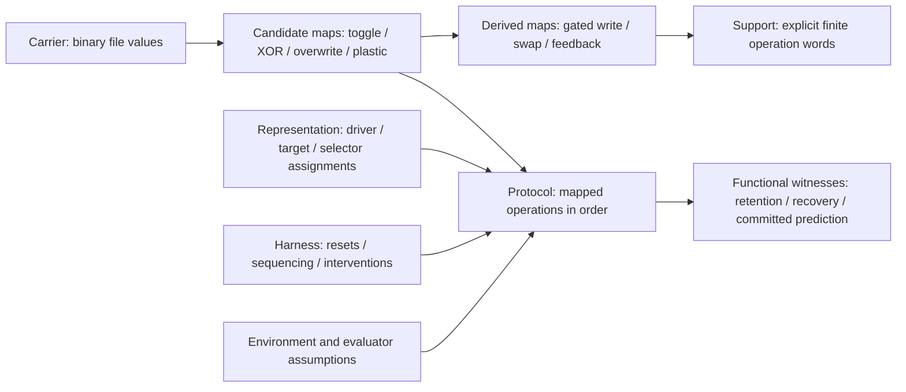
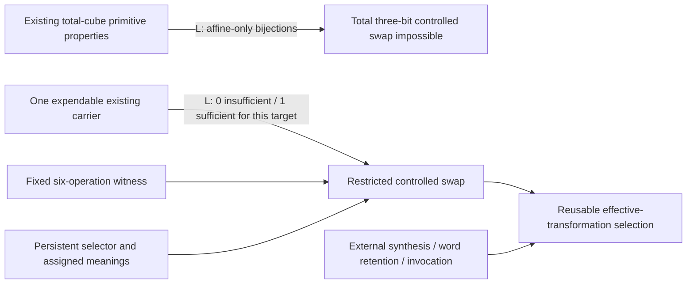

# ArxMentis: substrate, composition, and evidence

This is the research account for the authoritative local repository at
`E:\ArxMentis`, audited on 2026-10-09 against local commit `6ab8e62`.
No experimental branch was imported. `arxmentis.py` and all 40 historical tests
are preserved byte for byte. The README remains the chronology; this document
classifies its claims by their support rather than treating that chronology as
an ordered list of fundamental cognitive kinds.

The central question is how much effective structure the existing persistent
transformations generate under composition. The experiments establish finite
value-map identities, bounded search results, and limited transport properties.
They do not establish endogenous program discovery, execution control, learned
prediction, or general agency.

## 1. Exact state scope and physical carriers

The configured persistent paths are all beside `arxmentis.py`. At the initial
inspection none of these five files existed. Missing files read as zero without
being created. Each configured carrier can persist one binary value; five
independent valid files admit 32 value configurations, or five bits of capacity.
This is distinguishable configuration capacity, not a claim about information
content, a probability distribution, or a functional type.

| Physical identity | Reads through current default CLI paths | Writes through current default CLI paths | Roles assigned in historical tests |
| --- | --- | --- | --- |
| `.arxmentis-state` (D1) | `read`; target reads when distinction 1 is selected; driver reads when distinction 2 is selected; `evaluate`, `predict-next`, `adapt-context` | target writes through `toggle`, `step`, `copy`, `memory-step`, `plastic-step`, `adapt` when distinction 1 is selected | independent distinction; driver; externally changed environment; context; current observation |
| `.arxmentis-state-2` (D2) | `read`; target reads when distinction 2 is selected; driver reads when distinction 1 is selected; `evaluate`, `adapt-context` | target writes through the same selected-distinction commands; `adapt-context` | distinction; response/controlled target; present state; externally prepared anticipation |
| `.arxmentis-memory` (M) | `read-memory`, `memory-step`, `plastic-step` | `copy`, `evaluate`, `adapt`, `adapt-context`, `predict-next` | overwritten target; retained history; mismatch/error; transition selector; committed prediction |
| `.arxmentis-policy` (P / P0) | `read-policy`, `toggle-policy`, `adapt` with `--context 0`; `adapt-context` if D1=0 | `toggle-policy`, `adapt` with `--context 0`; `adapt-context` if D1=0 | XOR/COPY action choice; retained experience; context-zero association; **no-op/toggle** choice in the delayed-credit harness |
| `.arxmentis-policy-1` (P1) | `read-policy`, `toggle-policy`, `adapt` with `--context 1`; `adapt-context` if D1=1 | corresponding policy commands and context-selected adaptation | context-one association |

Every API path parameter can instead refer to another physical file. Generic
`read_state`/`write_state` can read/write any supplied path. Thus five is the
configured carrier count, not a hard limit enforced by the runtime. Research
runs use isolated temporary files, at most five per state space, and leave the
configured runtime carriers untouched. No new runtime carrier was added.

**Declared equivalence:** both programs have identical final value tuples for
every initial value tuple in the same declared cube, including all overwritten
carriers and untouched coordinates. Inputs are existing valid files at distinct
paths. State order is lexicographic: `00,01,10,11` or `000,...,111`; table entries
are indices into that order. This includes identity at length zero.

The scope excludes file existence, timestamps, newline formatting, stdout,
return tuples, intermediate writes, crashes, and aliasing. The runtime accepts
aliased paths: `dependent_transition(path,path)` writes zero, for example.
Therefore transport/equivalence here is **not** a theorem for aliases or
observational boundaries that inspect intermediate states. Missing-file and
corruption behavior remains covered by historical tests, outside these cubes.

## 2. Complete inventory of mutating functions

All equations below assume distinct paths. Other configured carriers are
untouched. Default file arguments are convenience bindings; the transformation
bodies use supplied paths and values, not semantic filename recognition.
`read_state` is nonmutating (including the missing-file case).

| Function | Values read | Full output equation | Persistent writes | Untouched inputs; role specificity |
| --- | --- | --- | --- | --- |
| `write_state(v,path)` | explicit integer v; no existing bit read | x'=v, v in {0,1}; other values rejected | one path, parent directory created if needed | every other path; generic, externally specified value |
| `toggle_state(path)` | x | x'=1-x | one path | every other path; generic |
| `dependent_transition(d,t)` | d,t | (d',t')=(d,d XOR t) | t | d; generic ordered input/target |
| `memory_dependent_transition(t,m)` | t,m | (t',m')=(t XOR m,m) | t | m; exactly `dependent_transition(m,t)` |
| `copy_transition(d,t,m)` | d,t; old m is not read | (d',t',m')=(d,d,t) | m first, t second | d; old m erased; generic, two-output mapping |
| `evaluate_criterion(a,b,m)` | a,b; old m is not read | (a',b',m')=(a,b,a XOR b) | m | a,b; return success iff m'=0 is a programmed equality interpretation |
| `plastic_transition(d,t,s)` | d,t,s | (d',t',s')=(d, d XOR ((1-s) AND t),s) | t | d,s; selector role generic; s=1 does **not** retain old t in s |
| `commit_alternating_prediction(d,q)` | d; old q not read | (d',q')=(d,1-d) | q | d; binary map generic, alternating-world interpretation hard-coded |
| `adaptive_transition(d,t,m,p)` | d,t,p; old m not read | u=d XOR ((1-p) AND t); (d',t',m',p')=(d,u,d XOR u,p XOR (d XOR u)) | t, then m, then p | d; generic paths, programmed equality and update sequence |
| `contextual_adaptive_transition(d,t,m,p0,p1)` | d,t,p[d]; old m and inactive p not used for the update | u=d XOR ((1-p[d]) AND t); t'=u, m'=u, p[d]'=p[d] XOR u | t, m, active p | d and inactive p; generic paths, programmed routing by d and criterion t'=0 |
| `main()` | command/options and the function-specific values above | dispatcher; delegates to the mappings above | command-dependent | CLI imposes default role assignments; no extra persistent state |

Both adaptive functions return snapshots as well as writing files. Their
reduction below compares persistent final states, not those return interfaces.
There is no autonomous loop in the runtime: repeated calls are initiated by the
CLI caller or test harness.

A correction of **classification**, not runtime behavior: historical copy
fixed-point tests inspect `(D1,D2)`. That projection stabilizes after one copy.
The full `(D1,D2,M)` mapping can change again on the second copy because M then
receives the new D2. Two copies map every triple to `(d,d,d)`; a third has no
further effect. The retained bit distinguishes selected old target values, but
copy still erases old M and is noninvertible on the full cube (four outputs for
eight inputs). Historical tests remain correct in their declared projections.

## 3. CLI classification

| Commands | Current classification | Boundary and programmer contribution |
| --- | --- | --- |
| `read`, `read-memory`, `read-policy` | observational/control helpers | externally requested observation and path selection; no writes |
| `toggle`, `toggle-policy` | direct exposure of candidate toggle | one selected carrier |
| `step` | direct exposure of candidate dependent XOR | target may be overridden; driver comes from the other default distinction |
| `memory-step` | direct exposure of XOR with different role assignment | no fundamental memory-specific law |
| `copy` | direct exposure of candidate **two-output** copy map | candidate is reducible when lower functions may be assigned other roles |
| `plastic-step` | direct exposure of candidate plastic map | its copy-valued branch differs from full `copy_transition` |
| `evaluate` | direct exposure of candidate overwrite/equality control | persistent map is XOR overwrite; success interpretation is programmer supplied |
| `adapt` | composite action/evaluate/update protocol | Python supplies the within-call order and criterion |
| `adapt-context` | composite routing/action/evaluate/update protocol | Python selects the policy from D1 and uses D2=0 as criterion |
| `predict-next` | hard-coded-model control exposing a derived state map | `Q=1-D1`; no environmental transition or learning inside this command |

`--context` selects the file for `read-policy`, `toggle-policy`, and `adapt`;
`adapt-context` instead reads D1 to select its active policy. `evaluate` and
`adapt-context` use the two default distinction paths; `predict-next` reads
default D1. A `--state-file` override does not change those commands' input
selection. These are CLI bindings, not properties of the generic file functions.

## 4. Candidate basis and behavioral reducibility

The initial candidates are toggle, dependent XOR, memory-dependent XOR, full
copy, plastic, and evaluation overwrite. "Primitive" remains relative to an
explicit basis and admissible role bindings.

* Memory-dependent XOR equals dependent XOR with the retained/selector path in
  the driver role, over all eight triples.
* Full copy is exactly `evaluate(d,t,s); xor(s,t); xor(d,s)`. Intermediate
  selector values are `d XOR old_t`, then `old_t`; final target is d. All three
  coordinates match copy. Exhaustive audit search finds this as the unique
  shortest word of length three in that declared three-operation audit basis.
* Evaluation overwrite is exactly `copy(d,t,s); xor(d,s); xor(s,t)`. Copy first
  stores old t in s, the next XOR forms d XOR old t in s, and the last restores
  old t to t. Another shortest length-three word in the declared four-operation
  audit basis is `xor(d,t); copy(d,t,s); xor(s,t)`.

Thus the initial function list is not irreducible. Either copy or evaluation
can support the other when role-remapped XOR calls are available. Candidate
schema bases `{toggle, XOR, evaluation, plastic}` and
`{toggle, XOR, copy, plastic}` both reproduce that list. Neither is claimed
absolutely minimal. Supplying `write_state` arguments and conditional sequences
from Python is separate machinery and is not silently included as a free law.

A rigorous obstruction does survive this reduction: all initial candidates
except plastic are affine binary maps (checked against every input). Composition
of affine maps remains affine: `(Ax+b)` followed by `(Cx+e)` is
`CAx+(Cb+e)` over GF(2). Plastic has the product term `(1-s)t`, and its full table
is nonaffine. Therefore **no straight-line composition of the other affine
candidate schemas, even with distinct-carrier role remapping, realizes plastic**.
The nonlinearity is already present in the runtime; no new primitive is needed
to introduce it. Host conditional branching changes that premise and must be
accounted for explicitly.

## 5. Finite composition experiments

The harness samples complete primitive tables by calling the real file-backed
functions. It then composes these tables in execution order, canonicalizes full
outputs, and uses breadth-first traversal to retain a shortest witness. All 538
three-bit witnesses are separately replayed against actual files over all eight
inputs in the regression suite. Word enumeration independently checks the BFS
through length three. A 50,000-table cap raises an explicit error rather than
reporting a partial frontier as complete.

B2 on `(a,b)` contains `toggle(a)`, `toggle(b)`, `xor(a,b)`, `xor(b,a)`.
B3 on `(d,t,s)` contains `toggle(d)`, `toggle(t)`, `toggle(s)`, `xor(d,t)`,
`memory(t,s)`, `copy(d,t,s)`, `plastic(d,t,s)`, `evaluate(d,t,s)`.
These are **fixed role bindings**. B3 does not include every permutation of
parameters merely because the functions accept them.

| Minimum witness length | New B2 maps | Cumulative B2 (with identity) | New B3 maps | Cumulative B3 (with identity) |
| --- | ---: | ---: | ---: | ---: |
| 0 | 1 | 1 | 1 | 1 |
| 1 | 4 | 5 | 8 | 9 |
| 2 | 9 | 14 | 42 | 51 |
| 3 | 7 | 21 | 147 | 198 |
| 4 | 3 | 24 | 340 | 538 |
| 5 | 0 | 24, saturated | not enumerated | not established |

B2 is exhausted: it generates exactly all 24 permutations of the four states.
It cannot generate any noninvertible map; all its generators are invertible and
composition preserves invertibility. There are 256 total maps on that state
space, so expressivity here is complete for permutations, not for all mappings.

B3 is **not exhausted**. Its length-four result is a lower bound on closure
size, not the entire closure. One all-length limitation is proven independently:
every B3 generator has `d'=d XOR c` for a constant c. Composition preserves that
form. The desired map `d'=t` is outside this particular fixed-role closure.
Existing role-remapped file functions can write d; this obstruction does not
justify proposing a new runtime law.

The complete sampled tables, all retained witnesses, source hashes, and search
solutions are in [composition_results.json](composition_results.json), generated
by [composition_experiments.py](composition_experiments.py). Compression here is
external identification of equal finite maps with retained program support.
It is not runtime macro storage.

## 6. Derived gated write and pass-through

The supplied candidate is reproduced unchanged:

```text
xor(d,t); plastic(d,t,s)
```

Its full result is `(d, t if s=0 else d, s)`. Driver and selector survive.
There are two shortest length-two witnesses in B3: the above and
`plastic(d,t,s); plastic(d,t,s)`. The second is an alternative realization;
dependent XOR is therefore not a necessary parent of every gated-write witness.
Neither result is a new runtime function.

| Input (d,t,s) | Output (d,t,s) |
| --- | --- |
| 000 | 000 |
| 001 | 001 |
| 010 | 010 |
| 011 | 001 |
| 100 | 100 |
| 101 | 111 |
| 110 | 110 |
| 111 | 111 |

Actual A/B/C file assignments cover all six permutations and eight input rows:
48 passing rows. The stronger regression assigns four actual files to
`d,t,s,guard` in all 24 permutations, testing all 16 initial values: 384 passing
rows, including preservation of an unused carrier. Reversing XOR/plastic fails
(e.g. 101 becomes 101 rather than 111). Pass-through is a structural property
of this ordered sequence, not permission to commute arbitrary operations.

The transformation is role-generic over binary carriers for this declared
interface: distinct valid files and the named roles. This supports a limited
transport result, not broad generalization or disappearance of all semantic
protocol differences.

Other shortest effective maps, absent as length-one B3 candidates, include:

* `copy; copy`: `(d,t,s) -> (d,d,d)`, minimum two operations;
* `evaluate; plastic`: overwrite feedback then selection, minimum two operations;
* two-bit swap: minimum three operations, detailed below.

Their complete tables and shortest supports are retained in the evidence file.

## 7. Binary recoding

Simultaneous complement applies to **every** state coordinate.
`F_phi = phi F phi^-1`, with `phi(x)=1-x` and `phi^-1=phi`.

| B3 candidate | Same-map invariant? | Shortest transported support in B3 |
| --- | --- | --- |
| toggle on d, t, or s | yes | same toggle |
| dependent XOR d -> t | no | `toggle(t); xor(d,t)` |
| memory XOR s -> t | no | `toggle(t); memory(t,s)` |
| full copy | yes | same copy |
| plastic | no | `toggle(t); toggle(s); plastic; toggle(s)` |
| evaluation | no | `evaluate; toggle(s)` |

Gated write is not invariant: its complement-transported map writes d when
s=0 and retains t when s=1. Its shortest B3 witness has length four:
`toggle(s); xor(d,t); plastic(d,t,s); toggle(s)`. All eight rows and six physical
assignments pass for that transported program; selector restoration is checked.

Among the 538 bounded B3 maps, 54 are invariant, 280 noninvariant maps have their
transported map in the same length-four inventory, and 204 transported forms
are absent **from that bounded inventory**. Those 204 are not outside closure:
phi itself is the three-toggle program, so `phi; witness; phi` realizes each
transport using existing operations in at most ten steps. This identity is
verified for all 538 maps. No transformation in this declared basis has a
proved unrepresentable complement transport. All B2 transports lie in its
exhausted 24-map closure.

Representation equivalence is identified by this external research harness.
The runtime does not itself identify equivalent maps or discover their support.

## 8. High-level command audit

### adapt

Full 16-row equivalence is established for:

```text
plastic(d,t,p)
evaluate(d,t,m)
xor(m,p)
```

`p XOR m` implements the existing win-stay/lose-shift rule. This is the unique
shortest length-three sequence over the explicitly declared audit basis
containing those three bound operations. No global shortest claim is made over
all possible parameterizations. The runtime implements the sequence directly
in Python. Equality defines success; the harness initiates cycles, changes the
environment, measures recovery, and decides when to stop.

### adapt-context

For each of all 32 five-bit inputs, choose `active=p0` if d=0 else p1, then:

```text
plastic(d,t,active)
evaluate(d,t,m)
xor(d,m)
xor(m,active)
```

Evaluation and the following XOR make `m=t'`, so this is the zero-target
criterion, not adapt's equality criterion. Only the active policy is updated;
the other is preserved. The full lower protocol equals the direct function.
**The active-path choice is conditional sequencing in the audit harness,
mirroring conditional Python routing inside the current command.** This does
not establish a single straight-line reduction over an enumerated five-bit
basis. Such a reduction is unresolved, not proved impossible or grounds for a
new primitive. The harness still supplies contexts and episode resets.

### predict-next

The existing map is exactly `(d,t,m) -> (d,t,1-d)`. A complete eight-row reduction
that preserves the scratch/input t is:

```text
evaluate(d,t,m)   # m = d XOR t
xor(t,m)          # m = d
toggle(m)         # m = 1-d
```

The last two operations can exchange order; both are shortest length-three
words in this declared three-operation audit basis. The equivalence is final
state only: the intermediate write m=d XOR t is visible to a stronger observer.

`Q=1-D1` is a programmer-encoded alternating-world model. The historical test
establishes a prediction committed to persistent M before an externally
imposed observation transition. The alternating law and its interpretation
were supplied in code; reducing its state map does not convert it to learned
prediction. Even the evaluation function can play a non-evaluative intermediate
role in this sequence, illustrating why names are not fundamental state kinds.

## 9. Typed evidence graph and dependency DAG

The research vocabulary distinguishes:

* **Carrier:** persistent distinguishable value capacity, independent of role.
* **Candidate transformation:** directly implemented map included in a declared
  basis; primitivity is relative until reducibility has been assessed.
* **Derived transformation:** a distinct full map with finite compositional
  support; preserve the shortest witness, not just its convenient name.
* **Protocol:** ordered operations, potentially with host/environment/evaluator
  actions and conditional routing.
* **Functional capability:** an observable property of a specified protocol.
* **Representation/map:** assignment of roles/interpretations to carriers and
  configurations, including success encoding.
* **Harness contribution:** resets, interventions, sequencing, observations,
  evaluation timing, role assignments, and stopping rules supplied externally.

This support graph records **demonstrated realization**, not untested necessity:



The capability DAG below uses three edge meanings. **P** is a provisional
requirement of the stated witness with no general removal theorem. **W** is a
witness-specific controlled comparison or projection argument. **L** is a
proved lower bound/obstruction under the stated basis. Multiple parents are
conjunctive supports, not a forced universal cognitive ladder.

```mermaid
flowchart TD
  C[Persistent carrier] -. P .-> REC[Recovery across process exit]
  C -. P .-> REL[Pair relation]
  COMP[Comparison in harness] -. P .-> REL
  XOR[Dependent XOR] -. P .-> CYCLE[Period-2 / period-3 witnesses]
  ORDER[Harness iteration and order] -. P .-> CYCLE
  COPY[Noninvertible copy] -. P .-> HIST[Histories distinguished after pair convergence]
  M[Observation of retained old target] -- W: identical pair, different retained bit --> HIST
  HIST -. P .-> FUT[Past-sensitive next transition]
  MX[Role-remapped XOR] -. P .-> FUT
  PL[Existing nonaffine plastic map] -- L: affine-only basis cannot realize gate --> GATE[Derived gated write]
  ORDER -. P .-> GATE
  AD[Action / criterion / policy-update protocol] -. P .-> LEARN[Measured recovery advantage]
  P[Retained policy value] -- W: reset task-state control, 1 vs 3 cycles --> LEARN
  ROUTE[Programmed policy routing and two policy bits] -. P .-> CTX[Context noninterference witness]
  RESET[Harness context and target resets] -. P .-> CTX
  TOG[Existing toggle] -. P .-> ANT[Anticipatory regulation witness]
  ALT[Externally alternating environment] -. P .-> ANT
  TIMING[Externally delayed evaluation and episode resets] -. P .-> CREDIT[Delayed-credit witness]
  P -. P .-> CREDIT
  ALT -. P .-> CREDIT
  HARD[Programmer alternating model 1-D1] -. P .-> PRED[Committed accurate prediction control]
  C -. P .-> PRED
  ALT -. P .-> PRED
  BX[B2 ordered XOR operations] -- L: shortest full swap has length 3 --> SWAP[Reusable swap map]
  SEARCH[External exhaustive search and replay] -. P .-> SWAP
```



W for retained history concerns the particular pair-converging trials, not all
possible history mechanisms. W for policy advantage concerns the controlled
perturbation task, not a necessity theorem for learning. L for gated write is
relative to the candidate affine-only basis and straight-line composition.
Removing dependent XOR does not remove gated write's alternative plastic-square
realization. L for swap is the exhaustively checked program-length lower bound,
not a claim that external search is intrinsically required for swap to exist.

Historical chronology therefore branches: relation is an observation; iteration
is supplied by the harness; M takes several roles; policy advantage depends on
retained values plus a specific action/evaluator protocol; prediction commitment
is compatible with a completely supplied model. No semantic faculty becomes a
new primitive by being named.

## 10. First program-search problem and reuse

B2, start `(1,0)`, exact goal `(0,1)`. Exhaustive word search proceeds by length
and is given only the basis and criterion. No zero- or one-operation program
succeeds. All five shortest length-two solutions are:

| Program in execution order | Complete table | States for which it is a swap |
| --- | --- | --- |
| toggle(a); toggle(b) | 3,2,1,0 | 01,10 |
| toggle(b); toggle(a) | 3,2,1,0 | 01,10 |
| toggle(b); xor(b,a) | 3,0,1,2 | 10 only |
| xor(a,b); toggle(a) | 2,3,1,0 | 10 only |
| xor(a,b); xor(b,a) | 0,3,1,2 | 00,10 |

There are four behavioral classes among those five words. The first solution
reuses on the other unequal instance `(0,1)->(1,0)`, with the same criterion
schema. It fails both equal-state instances of the full swap class. This is a
class solution for unequal inputs, not a uniform swap or broad generalization.
All five words have been replayed across both physical assignments and all
four initial states. Their complement-transported programs also replay: 80
full-state rows in total. Only the two toggle-order words solve the complemented
instance with the **same** program; the others require transported support.

A second search imposes the full class criterion `F(a,b)=(b,a)` over all four
states. It discovers exactly two shortest length-three programs:

```text
xor(a,b); xor(b,a); xor(a,b)
xor(b,a); xor(a,b); xor(b,a)
```

Both have table `0,2,1,3`. They pass all initial states, both physical carrier
assignments, and the complement-transported problem (swap commutes with
simultaneous complement). Sixteen direct file-backed role-reuse rows cover the
two supports. This is structural solution transport for this declared finite
swap problem, with no additional task-specific transition law.

The solver, basis declaration, goal/class selection, resets, canonicalization,
program retention, and replay all live in the research harness. ArxMentis did
not autonomously solve either problem. The solution is representable using its
existing substrate; discovery and reuse remain external.

## 11. Six-way contribution accounting

| Experiment | Carrier/state | Transformation laws | Representation/map | Sequencing | Environment | Evaluator |
| --- | --- | --- | --- | --- | --- | --- |
| Closure | 2 or 3 independent temporary binary files | tables sampled from B2/B3; no new runtime law | harness fixes coordinate order and role bindings | harness enumerates words and shortest witnesses | harness resets every input; no intervention during a word | exact full-table equality; contains no desired word |
| Gate/pass-through | 3 role carriers; fourth guard in regression | XOR/plastic; plastic-square alternative | harness permutes actual physical files | supplied candidate then enumerated shortest alternatives; order counterexample | no world transition; initial values supplied | stated gate equation and preserved coordinates contain desired behavior, not a sequence |
| Complement | same carriers, no additional capacity | original generators plus their composition | harness supplies simultaneous complement | harness computes conjugation/support; runtime does not discover it | each recoded initial state supplied | exact commuting table equality |
| High-level reduction | 4 for adapt; 5 for context; 3 for prediction audit | existing maps, including all overwritten outputs | input/target/policy/error roles assigned by protocol | runtime Python order; audit host branch for context | no environment flip inside command audits | equality or t'=0 supplied; alternating model supplied for predict-next |
| Instance/class search | 2 binary files | fixed B2 | harness chooses coordinates and swap problem class | external exhaustive BFS-by-length; external replay/retention | all starts externally reset | instance goal embeds answer state; class goal embeds desired full behavior, never a word |
| Historical adaptation | existing D1/D2/M/P | programmed action, equality, update | P=0 XOR/P=1 copy | runtime within-call protocol; harness repeats until its stopping predicate | D1 flips externally; task-state resets in isolation control | programmer equality and recovery-time metric |
| Context association | existing five paths | routing, selected action, zero-target criterion | d selects p[d]; action meanings supplied | runtime branch; harness training and revisit order | contexts and target starts supplied | D2=0 and policy retention/noninterference checks |
| Anticipation/delayed credit | existing values reused; no new bit | toggle/evaluate and harness win-stay/lose-shift | delayed-credit P means no-op/toggle, not XOR/copy | harness decides action, flip, delayed evaluation, and P write | alternating D1 and per-episode D2 reset | equality measured only after imposed flip |
| Prediction control | existing D1 and M | complement assignment supplied in predictor | M interpreted as a next-observation claim | harness commits, then flips D1, then compares | perfect alternating world supplied | matching committed bit against later observation |

## 12. Evidence boundary and next missing capability

Composition buys useful maps: gated writes with two alternative shortest
supports, all two-bit permutations, reuse under physical remapping, a transported
gate, and complete reductions of several semantically different functions.
It also exposes failed uniform reuse, order dependence, projection-sensitive
fixed points, and already encoded nonlinearity. None of these are novelty claims.

The next demonstrated gap is **endogenous retention and execution of a chosen
composition**, including internally determining the next operation. The runtime
stores binary values and computes each programmed command's substeps; it has no
representation/interpreter for the externally discovered words. External JSON
support is an audit record, not program memory. No such feature is implemented
here and no new primitive is proposed.

B2 was exhausted, and candidate affine irreducibility and the fixed-driver
obstruction have all-length proofs. B3 was deliberately bounded at four steps;
full five-bit straight-line closure was not attempted. Therefore this work has
not exhausted every composition over every admissible role binding, and cannot
claim that a desired cognitive faculty requires a new substrate law. Existing
complement transports have constructive support; bounded absence is not proof
of impossibility. These limits should guide the next research question rather
than reward the theory.

## 13. Mechanism Reification Boundary

This follow-up begins from the 60-test transformation-substrate baseline above.
It asks a narrower question than program memory: can one persistent bit select
IDENTITY versus SWAP while **one fixed operation word** consumes that bit and
acts on independent data? The representation meanings are supplied by the
experiment. No interpreter, stored sequence, runtime controller, new runtime
function, or sixth carrier is introduced.

### Target and complete table

Roles are `C,A,B`. The selector C must be preserved. The required map is:

```text
C' = C
A' = A XOR (C AND (A XOR B))
B' = B XOR (C AND (A XOR B))
```

Both the formula and an independently recovered algebraic normal form match
all eight rows. The existing canonical table representation gives
`(0,1,2,3,4,6,5,7)` in state order `000,...,111`.

| Input C,A,B | Output C,A,B |
| --- | --- |
| 000 | 000 |
| 001 | 001 |
| 010 | 010 |
| 011 | 011 |
| 100 | 100 |
| 101 | 110 |
| 110 | 101 |
| 111 | 111 |

The target is bijective, nonaffine, and degree two. Its ANF is
`C'=C`, `A'=A XOR CA XOR CB`, `B'=B XOR CA XOR CB`.
It does not occur in the prior retained 538-map fixed-role inventory.

### Basis audit and total three-bit impossibility

The admitted schemas are the same low-level candidates: toggle, dependent XOR,
memory-dependent XOR, copy, plastic, and evaluation. All valid distinct-carrier
assignments are sampled from current runtime calls. Initialization writes,
`adapt`, `adapt-context`, and `predict-next` are not silently admitted as new
unit-cost primitives. Copy's two writes count as the one existing candidate
mapping already included in the declared basis.

There are 33 labeled three-bit calls and 24 distinct primitive tables. Labels
include all memory/XOR aliases and both orders of symmetric evaluator inputs.
The complete properties for every label, including a collision witness where
applicable and ANF terms, are recorded under `mechanism_reification` in the
existing evidence JSON.

| Schema, every valid assignment | Image size on eight states | Affine? | Bijective? |
| --- | ---: | --- | --- |
| toggle | 8 | yes | yes |
| dependent XOR | 8 | yes | yes |
| memory-dependent XOR | 8 | yes | yes |
| copy including retained-value write | 4 | yes | no |
| evaluation overwrite | 4 | yes | no |
| plastic | 6 | no | no |

The possible argument succeeds on the declared total domain:

1. A bijective composition cannot contain a noninjective factor. Consider its
   first noninjective factor. The preceding factors are bijections, so their
   image is the whole finite cube. That factor merges at least two distinct
   inputs, and no deterministic suffix can separate them again.
2. Thus any realizable total bijection uses only the bijective primitives.
3. All those primitives are affine. Affine composition is affine.
4. The required controlled swap is a nonaffine bijection, so it is outside this
   total three-bit closure at **every program length**.

This is not inferred from a failed bounded search. As an independent finite
check, BFS exhausts the nine canonical bijective generators at 1,344 maps,
with new counts `[1,9,51,187,393,474,215,14,0]` for lengths 0 through 8. The
configured bound is 12 and cap 5,000; saturation is reached before either.
Controlled swap is absent. The other candidate maps are excluded from that
bijective search by the proved rank obstruction, not by a search heuristic.

Role permutation does not rescue a total noninjective primitive: every admitted
assignment was sampled and has the rank listed above. Aliases are explicitly
excluded from this theorem. Restricting the input domain can rescue injection
on that subset, which is why the workspace experiment is separate.

The same premises also hold for all four-bit low-level assignments: every
bijective primitive is affine. Consequently a total four-bit controlled swap
that preserves arbitrary W is also impossible in this basis. This statement
does not prohibit the restricted-domain witness below.

### One existing workspace carrier changes reachability

Use roles `C,A,B,W` and declare `W=0` at entry and exit. These four roles consume
four of the five existing carrier capacities; the fifth is an untouched guard
in remapping regressions. All executor operations have distinct role paths.

The complete admissible input indices in the sixteen-state cube are
`0,2,4,6,8,10,12,14`. Required output indices are
`0,2,4,6,8,12,10,14`. The search compares all eight persistent output tuples,
including C and W. It never selects an executor word by branching on a runtime
selector or data value.

The extended role-complete basis has 100 labeled operations and 76 distinct
full sixteen-row primitive tables. The existing composition machinery is
extended with bounded forward BFS and complete-preimage backward BFS over
restricted maps. Behavioral pruning merges equal full output tuples on all
admissible inputs. A prefix that merges two required input rows is discarded
because no suffix can restore their distinction. No full-cube noninjective
primitive is discarded merely for being noninjective globally.

The inverse search considers **every** preimage for a noninjective primitive;
choosing one arbitrary inverse would miss solutions. Search is capped at
500,000 distinct tuples per direction, with prefix and suffix bounds both three.
The complete search covers every program of length at most six, not just the
selected word. No cap was reached.

| Depth | New forward tuples | New backward tuples |
| ---: | ---: | ---: |
| 0 | 1 | 1 |
| 1 | 22 | 13 |
| 2 | 394 | 2,422 |
| 3 | 6,226 | 51,970 |

No layers meet with combined length below six. At length six, the two depth-three
frontiers meet in 38 tuples. Re-enumerating every primitive edge between shortest
layers recovers all support lost during behavioral deduplication. This finds:

* **Minimum executor length: six**, in the 76-table role-complete basis on the
  eight-state `W=0` domain.
* **502 shortest words** after merging identical primitive-table labels.
* **5,008 shortest labeled words** after expanding all memory/XOR and evaluator
  aliases. Both complete lists are retained in `composition_results.json`.
* One behavioral class on the declared admissible domain, and **22 distinct
  full sixteen-state maps** outside that restriction. Every full class has
  image size eight. A representative of each was replayed on real files over
  all sixteen initial states.

The selected fixed shortest executor is:

```text
copy_transition(A, B, W)
plastic_transition(W, A, C)
plastic_transition(A, W, C)
plastic_transition(B, A, C)
copy_transition(W, A, B)
dependent_transition(A, W)
```

C appears only in selector positions; it is unchanged at every step. These are
ordinary calls to the unchanged runtime functions. The word is stored as
experimental support in the research harness, not in persistent ArxMentis state.

For original values a,b,c, define
`u=(1-c)a XOR cb` and `v=(1-c)b XOR ca`. The exact progression is:

| Step | C | A | B | W |
| --- | --- | --- | --- | --- |
| entry | c | a | b | 0 |
| copy A into B, retain B in W | c | a | a | b |
| plastic W into A, selector C | c | b XOR (1-c)a | a | b |
| plastic A into W, selector C | c | b XOR (1-c)a | a | u |
| plastic B into A, selector C | c | v | a | u |
| copy W into A, retain A in B | c | u | v | u |
| XOR A into W | c | u | v | 0 |

This verifies both behaviors without a harness branch: c=0 yields a,b unchanged;
c=1 yields b,a. For either unequal data pair, changing only persisted C changes
the output pair. Equal data pairs are correctly unchanged under either choice.

### Workspace is capacity, not necessarily an initialization instruction

The selected word begins by overwriting W with old B. It actually implements
`(C,A,B,W) -> (T(C,A,B),0)` for **all sixteen** inputs, regardless of old W.
Therefore zero initialization is not needed to obtain the data behavior. Zero
is the entry value for the requested restoration contract and the reusable
workspace subset, not hidden solution information.

Old W is erased. The selected full table is
`(0,0,2,2,4,4,6,6,8,8,12,12,10,10,14,14)`, with image size eight.
It is not a total four-bit permutation that preserves arbitrary W. Every
selected prefix preserves all eight admissible input distinctions while its
full sixteen-state image has size eight after the first copy. This is exactly
where the total-domain impossibility argument ceases to apply.

Under this declared basis, distinct independent C/A/B inputs, and fixed words,
zero extra workspace is impossible and one existing expendable bit suffices.
Thus the workspace lower/upper bounds meet at **one bit** for this target.
This does not establish a universal workspace theorem for other mechanisms.

### Persistence, actual physical remapping, and selector recoding

The same C is retained while the harness changes **only A and B** and invokes
exactly the same executor again. Sixteen repeated executions cover both selector
values and all four data pairs twice. C's file contents remain unchanged after
each primitive, and W returns to zero. A subprocess regression verifies reuse
of the stored selector across process lifetimes; its child runs the same fixed
word and has no selector-based harness branch.

Four actual temporary files named after the existing D1, D2, M, and P carrier
files are assigned to C/A/B/W in all 24 permutations. An existing-fifth-carrier
analogue is held as an unused guard, tested at both values. Normal and recoded
executors each cover all eight C/A/B inputs for every assignment and guard value:
**768 passing full-state rows** in total. These temporary files exercise generic
path parameters without writing the repository's configured live state files.

Selector recoding complements **C alone**, leaving A, B, and W encoding unchanged.
The meanings exchange: physical C=0 now selects SWAP, physical C=1 IDENTITY.
The transported target is `phi_C F phi_C^-1`, where phi_C is a toggle of C.
The original executor is not invariant, as the unequal-data rows demonstrate.

Conjugating by toggle(C) gives an eight-operation witness, but minimization
finds a six-operation transported executor. Only step five changes:

```text
copy_transition(A, B, W)
plastic_transition(W, A, C)
plastic_transition(A, W, C)
plastic_transition(B, A, C)
copy_transition(A, W, B)       # transported assignment
dependent_transition(A, W)     # same final cleanup
```

C remains unchanged throughout this selected word.
Its full table is `(0,0,4,4,2,2,6,6,8,8,10,10,12,12,14,14)`.
The transported search has the same frontier counts and 38 depth-three meeting
tuples, minimum six, **384 canonical shortest words**, **3,284 labeled words**,
and 22 full-state behavior classes. All shortest supports and class membership
are retained; every full class also has a real-file sixteen-row representative.
No new primitive is required for selector representation transport.

### Evidence interpretation and contribution accounting

The earned claim is:

> A persistent distinction can represent one of two effective state
> transformations, IDENTITY or SWAP, and one fixed externally supplied mechanism
> composed of existing runtime transformations can consume it on independent
> data, using one expendable existing workspace carrier.

The bit distinguishes two effective transformations extensionally. It does not
encode a three-XOR swap realization, the six-step executor, or their order.
Different shortest executor mechanisms can support the same selector meanings.

| Contribution | What remains supplied |
| --- | --- |
| Carrier/state | Four existing capacities assigned C/A/B/W; harness initialization and data changes; fifth preserved; old W expendable |
| Transformation law | Existing sampled low-level maps and their composition; no task-specific runtime law added |
| Representation/map | Experiment assigns C=0 IDENTITY and C=1 SWAP, and chooses selector-only recoding |
| Sequencing | External search, retained witness, fixed operation invocation, process/reuse schedule, and stopping rules; no branch on runtime C/A/B to choose the word |
| Environment | Temporary file backend and independently supplied data; no environmental transition within an execution |
| Evaluator | Experiment supplies the complete desired table and exact selector/data/workspace/guard checks; it specifies desired behavior without supplying a search word |

This is persistent effective-transformation selection by a fixed executor.
Unearned claims remain arbitrary programs as data, stored sequences, a general
interpreter, endogenous program synthesis/search, self-modification, autonomous
execution control, and behavior fully becoming first-class data. The executor
word is still chosen and supplied externally; no runtime execution controller
was installed by this experiment.

The evidence graph gains a proved total-domain obstruction and a restricted
workspace-supported capability:



A new structural primitive is **not necessary for this restricted target**.
For a total three-bit realization that preserves all independent information,
the current basis lacks a reversible nonlinear map. Adding only more
noninjective maps would not overcome the rank argument. Reversible nonlinearity
is a necessary structural change for that total-domain objective, not a proved
sufficient expansion or a request to choose a gate. No basis expansion is made.

The next research questions are the capacity of fixed transformation selectors
and the cost of expendable workspace. Neither multi-bit selection nor a general
VM is implemented here. Endogenous retention of executor sequences and deciding
the next operation remain beyond this evidence boundary.

### Follow-up validation

Final follow-up validation: **12 focused selector tests passed** (24.267 s),
**32 experimental tests passed** (52.172 s), and **72 total tests passed**
(53.179 s). All 60 baseline tests, including the 40 unchanged historical tests,
are preserved. Python is the explicit repository venv, version 3.14.6.
Pylance 2026.4.1 in installed VS Code, basic mode with this interpreter,
reports zero Python diagnostics on both changed Python files; analysis
readiness and matching source hashes were checked. `git diff --check` and
all new-artifact trailing-whitespace checks pass. Runtime and historical
test SHA256 hashes match the baseline. `validation_results.json` records
these results and preserves the original 60-test validation as the prior pass.


## Reproduction and first-pass validation

Use the explicit repository interpreter:

```powershell
.\.venv\Scripts\python.exe composition_experiments.py --output composition_results.json
.\.venv\Scripts\python.exe -m unittest test_composition_experiments -v
.\.venv\Scripts\python.exe -m unittest
```

Baseline: Python 3.14.6, 40 tests passed, clean tracked working tree, and
`git diff --check` passed. Added regressions cover full-state side effects,
all-role gate transport, order failure, alias exclusion, every short closure
witness, independent BFS verification, resource caps, complement transport,
low/high-level reduction, the affine obstruction, and instance/class reuse.
First-pass source validation: **20 focused evidence tests passed; 60 total tests
passed (all 40 unchanged historical tests plus 20 new tests)**. The focused run
took 30.137 seconds and the full run 33.610 seconds. Every short B3 witness is
replayed on real files, accounting for most of that duration. Pylance 2026.4.1
ran inside installed VS Code with the explicit Python 3.14 venv and basic type
checking: zero Python diagnostics on both changed Python files, with analysis
readiness and final source hashes verified. Separate cSpell informational
spelling messages are not Python diagnostics. `git diff --check` passed, and
all new artifacts passed a trailing-whitespace check. Runtime and historical
test hashes match the baseline. Test-generated cache changes were cleaned up;
no historical tracked cache was deleted. Exact commands, source identities,
and diagnostic results are in [validation_results.json](validation_results.json).

## Appendix: every historical test and its harness decisions

All paths and starts are supplied by temporary-directory fixtures. The line
inventory below points to every direct bit initialization/reset/update and
direct toggle in the historical tests; the last column distinguishes their
experimental purposes. A direct write is not automatically a reset: delayed
credit includes a harness policy update. Calls/loops and CLI selection are
identified by the named test and its unchanged source entry point.

| Test | Source and direct harness mutations (one-based lines) | Sequencing, environment, representation, evaluator contribution |
| --- | --- | --- |
| `test_missing_state_reads_as_zero` | test_arxmentis.py:27 | Harness chooses absent path; interprets zero default and verifies no creation. |
| `test_toggle_persists_the_changed_value` | test_arxmentis.py:33; toggles 37 (path) | Harness invokes one toggle and then reads it; bit interpreted as distinction. |
| `test_cli_recovers_state_in_a_new_process` | test_arxmentis.py:40 | Harness chooses toggle then read, their file, process lifetimes, and expected stdout. |
| `test_distinctions_persist_independently` | test_arxmentis.py:61; direct writes 66; toggles 68 (second) | Harness initializes first, observes absent second, toggles second; independence comparison. |
| `test_cli_selects_the_second_distinction_file` | test_arxmentis.py:72 | Harness patches file routing and chooses CLI toggle of D2. |
| `test_dependent_transition_persists_target_and_preserves_driver` | test_arxmentis.py:89; direct writes 93,94 | Harness fixes driver=1,target=0 and selects one XOR. |
| `test_cli_steps_the_selected_distinction_from_the_other` | test_arxmentis.py:100; direct writes 104,105 | Harness initializes bits, patches routing, and selects CLI step of D2. |
| `test_cli_copies_the_other_distinction_into_the_selected_one` | test_arxmentis.py:119; direct writes 124,125 | Harness chooses pair and M, patches routing and CLI copy; M interpreted as old D2. |
| `test_counterfactual_driver_value_changes_target_transition` | test_arxmentis.py:150; direct writes 157,158 | Harness resets two trials, varies driver and holds target=0; compares target futures. |
| `test_action_outcome_value_depends_on_context` | test_arxmentis.py:165; direct writes 175,176 | Harness chooses both contexts, resets target=1, chooses copy/XOR, and evaluates target=0 itself. |
| `test_contextual_policy_learning_does_not_interfere` | test_arxmentis.py:189; direct writes 197,198,199,200,201,220,221,240,241 | Harness supplies context/training/revisit order and resets target to 1; reads retained policies and zero-target success. |
| `test_existing_policy_actions_cannot_prepare_for_next_context_from_zero` | test_arxmentis.py:254; direct writes 264,265,266,267,268; toggles 283 (driver) | Harness resets each policy trial, calls contextual adaptation, flips driver externally, and evaluates equality afterward. |
| `test_toggle_before_alternating_environment_change_preserves_equality` | test_arxmentis.py:293; direct writes 299,300,301; toggles 309 (target), 315 (driver) | Harness repeats eight supplied prepare-toggle/environment-toggle/evaluate sequences; decides timing and interprets anticipation. |
| `test_policy_receives_credit_after_environment_transition` | test_arxmentis.py:325; direct writes 332,333,334,335,340,356; toggles 349 (driver), 345 (target) | Harness resets target to driver each episode; P interpreted as no-op/toggle; harness selects action, flips environment, delays evaluation, and writes win-stay/lose-shift P. |
| `test_committed_prediction_precedes_and_matches_alternating_environment` | test_arxmentis.py:370; direct writes 377,378; toggles 394 (driver) | Harness repeats eight commit/read/externally-toggle/compare sequences; M interpreted as future observation; transition timing imposed. |
| `test_cli_commits_alternating_environment_prediction` | test_arxmentis.py:404; direct writes 408,409 | Harness chooses observation and CLI predict-next, patches routing and checks committed M before any flip. |
| `test_xor_transition_is_bijective_and_copy_is_not` | test_arxmentis.py:437; direct writes 446,447,455,456 | Harness exhausts four initial pairs and resets each trial; evaluator compares pair projection, excluding M. |
| `test_repeated_copy_transition_reaches_and_keeps_a_fixed_point` | test_arxmentis.py:465; direct writes 470,471 | Harness chooses two copies and measures only pair fixed point; M excluded from convergence criterion. |
| `test_memory_bit_distinguishes_collapsed_histories` | test_arxmentis.py:480; direct writes 490,491,492 | Harness resets two initial histories and fixes driver; M interpreted as overwritten target; compares equal present pairs. |
| `test_cli_reads_the_persisted_memory_bit` | test_arxmentis.py:503; direct writes 506 | Harness writes M=1 and selects CLI read-memory. |
| `test_memory_changes_future_with_present_held_fixed` | test_arxmentis.py:520; direct writes 528,529,530 | Harness resets trials, varies M while holding present pair; chooses one memory step and compares futures. |
| `test_cli_applies_memory_dependent_transition` | test_arxmentis.py:541; direct writes 546,547,548 | Harness supplies state/M, patches routing and selects CLI memory-step. |
| `test_history_selects_transition_for_same_present_pair` | test_arxmentis.py:572; direct writes 579,580,581,595,596,597; toggles 582 (second), 599 (second) | Harness invents two different copy/toggle histories, then chooses plastic; M interpreted as history/selector. |
| `test_adaptive_transition_retains_success_and_shifts_after_failure` | test_arxmentis.py:610; direct writes 616,617,618,619 | Harness chooses initial configuration and exact sequence of adaptive calls; programmer equality/update behavior checked. |
| `test_all_sixteen_initial_configurations_reach_satisfying_fixed_points` | test_arxmentis.py:640; direct writes 655,656,657,658 | Harness exhausts and resets all 16 states, iterates adapt at most 16 times, and stops on unchanged full state with equal pair. |
| `test_adaptation_recovers_after_environment_bit_changes` | test_arxmentis.py:698; direct writes 707,708,709,710; toggles 730 (driver) | Harness initializes fixed points, flips driver only, repeats adapt at most eight cycles; stopping predicate uses equality,M=0,and P=1 or driver=0. |
| `test_adaptation_learns_from_alternating_environment_changes` | test_arxmentis.py:783; direct writes 790,791,792,793; toggles 807 (driver) | Harness imposes eight alternating perturbations; repeats adapt until its fixed-point predicate; measures recovery cycles. |
| `test_learned_policy_improves_recovery_after_task_state_reset` | test_arxmentis.py:848; direct writes 857,858,859,860,893,894,895,896; toggles 862 (driver), 906 (trial_driver) | Harness trains, extracts P, resets other task state into separate control/trained trials, imposes flip; chooses stopping predicate and recovery-time comparison. |
| `test_cli_runs_adaptive_policy_evaluate_update_cycle` | test_arxmentis.py:944; direct writes 950,951,952,953 | Harness initializes four values, patches routing and selects CLI adapt; error/policy meanings supplied. |
| `test_cli_runs_context_selected_adaptation` | test_arxmentis.py:983; direct writes 990,991,992,993,994 | Harness initializes five values and D1 context, patches routing and selects CLI adapt-context. |
| `test_cli_runs_memory_selected_transition` | test_arxmentis.py:1024; direct writes 1029,1030,1031 | Harness initializes pair/selector, patches routing and selects CLI plastic-step. |
| `test_criterion_evaluation_writes_derived_mismatch_to_memory` | test_arxmentis.py:1054; direct writes 1060,1061,1062,1066,1067 | Harness supplies/reset pairs and evaluation timing; equality interpreted as success. |
| `test_criterion_feedback_selects_later_transition_rule` | test_arxmentis.py:1071; direct writes 1079,1080,1081 | Harness resets two trials, chooses evaluate then plastic; interprets M as evaluation then selector. |
| `test_cli_evaluates_equality_and_updates_memory_selector` | test_arxmentis.py:1100; direct writes 1105,1106,1107 | Harness initializes mismatch and chooses CLI evaluate, interpreting M as error/selector. |
| `test_transition_order_changes_the_final_state` | test_arxmentis.py:1123; direct writes 1130,1131 | Harness resets trials and chooses two opposite XOR target orders; final-state evaluator. |
| `test_repeated_dependent_transition_has_period_two` | test_arxmentis.py:1145; direct writes 1149,1150 | Harness fixes driver=1, repeats XOR four times and interprets period from collected values. |
| `test_repeated_ordered_pair_has_period_three` | test_arxmentis.py:1159; direct writes 1163,1164 | Harness initializes pair, chooses three rounds of target order (2,1); interprets recurrence at round boundary. |
| `test_pair_relation_is_derived_from_both_persistent_bits` | test_arxmentis.py:1179; direct writes 1185,1186 | Harness exhausts four pairs and itself computes XOR relation and inequality criterion; no runtime relation call. |
| `test_write_rejects_values_other_than_zero_or_one` | test_arxmentis.py:1190; direct writes 1194 | Harness supplies invalid value 2 and expects rejection. |
| `test_read_rejects_corrupted_state` | test_arxmentis.py:1196; direct writes 1199 | Harness writes invalid physical text and expects read rejection. |
