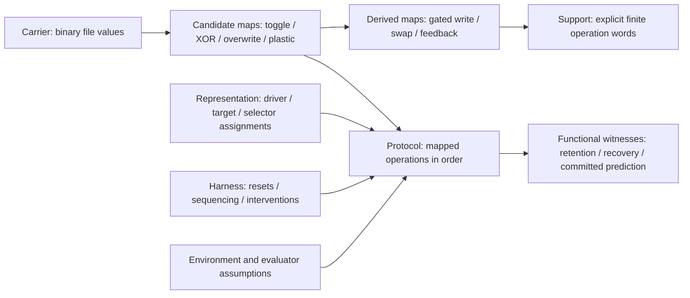
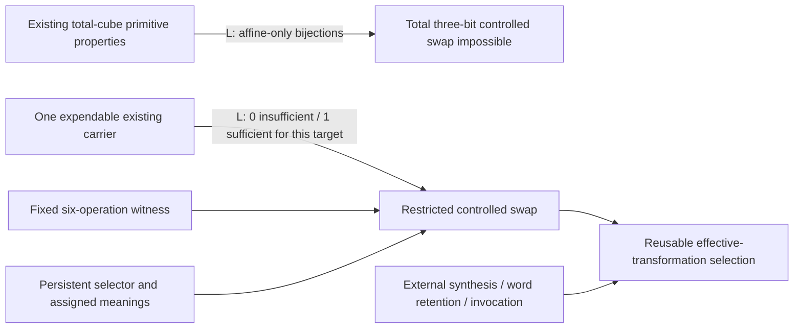
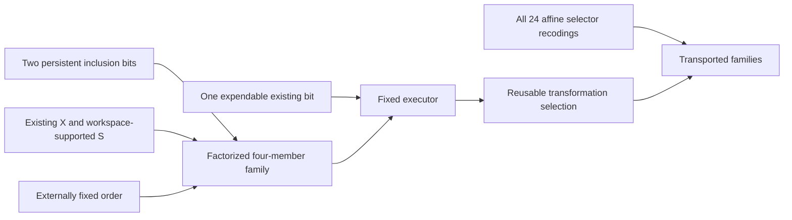
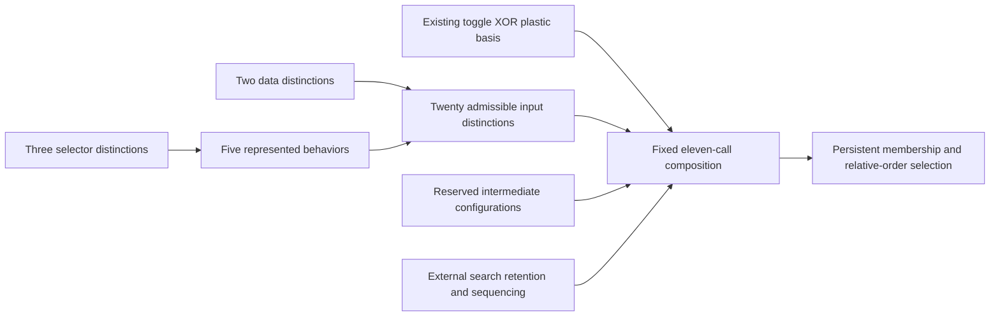
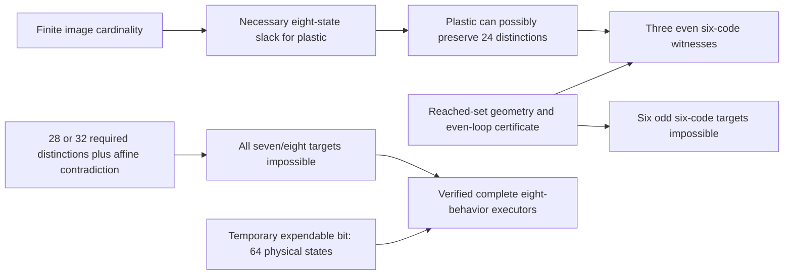
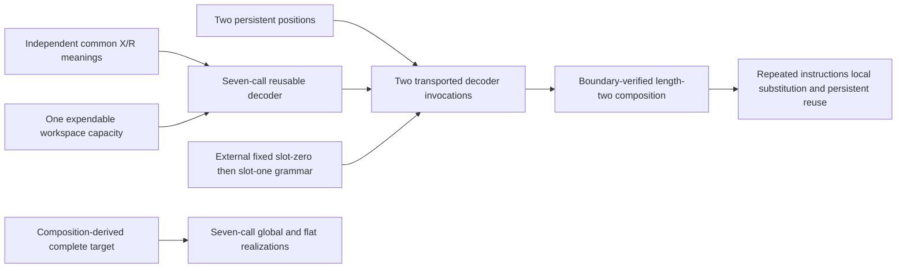

# ArxMentis: substrate, composition, and evidence

This is the research account for the authoritative local repository at
`E:\ArxMentis`, audited on 2026-10-09 against local commit `6ab8e62`.
No experimental branch was imported. `arxmentis.py` and all 40 historical tests
are preserved byte for byte. The README remains the chronology; this document
classifies its claims by their support rather than treating that chronology as
an ordered list of fundamental cognitive kinds.

The central question is how much effective structure the existing persistent
transformations generate under composition. The experiments establish finite
value-map identities, bounded search results, and limited transport properties.
They do not establish endogenous program discovery, execution control, learned
prediction, or general agency.

## 1. Exact state scope and physical carriers

The configured persistent paths are all beside `arxmentis.py`. At the initial
inspection none of these five files existed. Missing files read as zero without
being created. Each configured carrier can persist one binary value; five
independent valid files admit 32 value configurations, or five bits of capacity.
This is distinguishable configuration capacity, not a claim about information
content, a probability distribution, or a functional type.

| Physical identity | Reads through current default CLI paths | Writes through current default CLI paths | Roles assigned in historical tests |
| --- | --- | --- | --- |
| `.arxmentis-state` (D1) | `read`; target reads when distinction 1 is selected; driver reads when distinction 2 is selected; `evaluate`, `predict-next`, `adapt-context` | target writes through `toggle`, `step`, `copy`, `memory-step`, `plastic-step`, `adapt` when distinction 1 is selected | independent distinction; driver; externally changed environment; context; current observation |
| `.arxmentis-state-2` (D2) | `read`; target reads when distinction 2 is selected; driver reads when distinction 1 is selected; `evaluate`, `adapt-context` | target writes through the same selected-distinction commands; `adapt-context` | distinction; response/controlled target; present state; externally prepared anticipation |
| `.arxmentis-memory` (M) | `read-memory`, `memory-step`, `plastic-step` | `copy`, `evaluate`, `adapt`, `adapt-context`, `predict-next` | overwritten target; retained history; mismatch/error; transition selector; committed prediction |
| `.arxmentis-policy` (P / P0) | `read-policy`, `toggle-policy`, `adapt` with `--context 0`; `adapt-context` if D1=0 | `toggle-policy`, `adapt` with `--context 0`; `adapt-context` if D1=0 | XOR/COPY action choice; retained experience; context-zero association; **no-op/toggle** choice in the delayed-credit harness |
| `.arxmentis-policy-1` (P1) | `read-policy`, `toggle-policy`, `adapt` with `--context 1`; `adapt-context` if D1=1 | corresponding policy commands and context-selected adaptation | context-one association |

Every API path parameter can instead refer to another physical file. Generic
`read_state`/`write_state` can read/write any supplied path. Thus five is the
configured carrier count, not a hard limit enforced by the runtime. Research
runs use isolated temporary files, at most five per state space, and leave the
configured runtime carriers untouched. No new runtime carrier was added.

**Declared equivalence:** both programs have identical final value tuples for
every initial value tuple in the same declared cube, including all overwritten
carriers and untouched coordinates. Inputs are existing valid files at distinct
paths. State order is lexicographic: `00,01,10,11` or `000,...,111`; table entries
are indices into that order. This includes identity at length zero.

The scope excludes file existence, timestamps, newline formatting, stdout,
return tuples, intermediate writes, crashes, and aliasing. The runtime accepts
aliased paths: `dependent_transition(path,path)` writes zero, for example.
Therefore transport/equivalence here is **not** a theorem for aliases or
observational boundaries that inspect intermediate states. Missing-file and
corruption behavior remains covered by historical tests, outside these cubes.

## 2. Complete inventory of mutating functions

All equations below assume distinct paths. Other configured carriers are
untouched. Default file arguments are convenience bindings; the transformation
bodies use supplied paths and values, not semantic filename recognition.
`read_state` is nonmutating (including the missing-file case).

| Function | Values read | Full output equation | Persistent writes | Untouched inputs; role specificity |
| --- | --- | --- | --- | --- |
| `write_state(v,path)` | explicit integer v; no existing bit read | x'=v, v in {0,1}; other values rejected | one path, parent directory created if needed | every other path; generic, externally specified value |
| `toggle_state(path)` | x | x'=1-x | one path | every other path; generic |
| `dependent_transition(d,t)` | d,t | (d',t')=(d,d XOR t) | t | d; generic ordered input/target |
| `memory_dependent_transition(t,m)` | t,m | (t',m')=(t XOR m,m) | t | m; exactly `dependent_transition(m,t)` |
| `copy_transition(d,t,m)` | d,t; old m is not read | (d',t',m')=(d,d,t) | m first, t second | d; old m erased; generic, two-output mapping |
| `evaluate_criterion(a,b,m)` | a,b; old m is not read | (a',b',m')=(a,b,a XOR b) | m | a,b; return success iff m'=0 is a programmed equality interpretation |
| `plastic_transition(d,t,s)` | d,t,s | (d',t',s')=(d, d XOR ((1-s) AND t),s) | t | d,s; selector role generic; s=1 does **not** retain old t in s |
| `commit_alternating_prediction(d,q)` | d; old q not read | (d',q')=(d,1-d) | q | d; binary map generic, alternating-world interpretation hard-coded |
| `adaptive_transition(d,t,m,p)` | d,t,p; old m not read | u=d XOR ((1-p) AND t); (d',t',m',p')=(d,u,d XOR u,p XOR (d XOR u)) | t, then m, then p | d; generic paths, programmed equality and update sequence |
| `contextual_adaptive_transition(d,t,m,p0,p1)` | d,t,p[d]; old m and inactive p not used for the update | u=d XOR ((1-p[d]) AND t); t'=u, m'=u, p[d]'=p[d] XOR u | t, m, active p | d and inactive p; generic paths, programmed routing by d and criterion t'=0 |
| `main()` | command/options and the function-specific values above | dispatcher; delegates to the mappings above | command-dependent | CLI imposes default role assignments; no extra persistent state |

Both adaptive functions return snapshots as well as writing files. Their
reduction below compares persistent final states, not those return interfaces.
There is no autonomous loop in the runtime: repeated calls are initiated by the
CLI caller or test harness.

A correction of **classification**, not runtime behavior: historical copy
fixed-point tests inspect `(D1,D2)`. That projection stabilizes after one copy.
The full `(D1,D2,M)` mapping can change again on the second copy because M then
receives the new D2. Two copies map every triple to `(d,d,d)`; a third has no
further effect. The retained bit distinguishes selected old target values, but
copy still erases old M and is noninvertible on the full cube (four outputs for
eight inputs). Historical tests remain correct in their declared projections.

## 3. CLI classification

| Commands | Current classification | Boundary and programmer contribution |
| --- | --- | --- |
| `read`, `read-memory`, `read-policy` | observational/control helpers | externally requested observation and path selection; no writes |
| `toggle`, `toggle-policy` | direct exposure of candidate toggle | one selected carrier |
| `step` | direct exposure of candidate dependent XOR | target may be overridden; driver comes from the other default distinction |
| `memory-step` | direct exposure of XOR with different role assignment | no fundamental memory-specific law |
| `copy` | direct exposure of candidate **two-output** copy map | candidate is reducible when lower functions may be assigned other roles |
| `plastic-step` | direct exposure of candidate plastic map | its copy-valued branch differs from full `copy_transition` |
| `evaluate` | direct exposure of candidate overwrite/equality control | persistent map is XOR overwrite; success interpretation is programmer supplied |
| `adapt` | composite action/evaluate/update protocol | Python supplies the within-call order and criterion |
| `adapt-context` | composite routing/action/evaluate/update protocol | Python selects the policy from D1 and uses D2=0 as criterion |
| `predict-next` | hard-coded-model control exposing a derived state map | `Q=1-D1`; no environmental transition or learning inside this command |

`--context` selects the file for `read-policy`, `toggle-policy`, and `adapt`;
`adapt-context` instead reads D1 to select its active policy. `evaluate` and
`adapt-context` use the two default distinction paths; `predict-next` reads
default D1. A `--state-file` override does not change those commands' input
selection. These are CLI bindings, not properties of the generic file functions.

## 4. Candidate basis and behavioral reducibility

The initial candidates are toggle, dependent XOR, memory-dependent XOR, full
copy, plastic, and evaluation overwrite. "Primitive" remains relative to an
explicit basis and admissible role bindings.

* Memory-dependent XOR equals dependent XOR with the retained/selector path in
  the driver role, over all eight triples.
* Full copy is exactly `evaluate(d,t,s); xor(s,t); xor(d,s)`. Intermediate
  selector values are `d XOR old_t`, then `old_t`; final target is d. All three
  coordinates match copy. Exhaustive audit search finds this as the unique
  shortest word of length three in that declared three-operation audit basis.
* Evaluation overwrite is exactly `copy(d,t,s); xor(d,s); xor(s,t)`. Copy first
  stores old t in s, the next XOR forms d XOR old t in s, and the last restores
  old t to t. Another shortest length-three word in the declared four-operation
  audit basis is `xor(d,t); copy(d,t,s); xor(s,t)`.

Thus the initial function list is not irreducible. Either copy or evaluation
can support the other when role-remapped XOR calls are available. Candidate
schema bases `{toggle, XOR, evaluation, plastic}` and
`{toggle, XOR, copy, plastic}` both reproduce that list. Neither is claimed
absolutely minimal. Supplying `write_state` arguments and conditional sequences
from Python is separate machinery and is not silently included as a free law.

A rigorous obstruction does survive this reduction: all initial candidates
except plastic are affine binary maps (checked against every input). Composition
of affine maps remains affine: `(Ax+b)` followed by `(Cx+e)` is
`CAx+(Cb+e)` over GF(2). Plastic has the product term `(1-s)t`, and its full table
is nonaffine. Therefore **no straight-line composition of the other affine
candidate schemas, even with distinct-carrier role remapping, realizes plastic**.
The nonlinearity is already present in the runtime; no new primitive is needed
to introduce it. Host conditional branching changes that premise and must be
accounted for explicitly.

## 5. Finite composition experiments

The harness samples complete primitive tables by calling the real file-backed
functions. It then composes these tables in execution order, canonicalizes full
outputs, and uses breadth-first traversal to retain a shortest witness. All 538
three-bit witnesses are separately replayed against actual files over all eight
inputs in the regression suite. Word enumeration independently checks the BFS
through length three. A 50,000-table cap raises an explicit error rather than
reporting a partial frontier as complete.

B2 on `(a,b)` contains `toggle(a)`, `toggle(b)`, `xor(a,b)`, `xor(b,a)`.
B3 on `(d,t,s)` contains `toggle(d)`, `toggle(t)`, `toggle(s)`, `xor(d,t)`,
`memory(t,s)`, `copy(d,t,s)`, `plastic(d,t,s)`, `evaluate(d,t,s)`.
These are **fixed role bindings**. B3 does not include every permutation of
parameters merely because the functions accept them.

| Minimum witness length | New B2 maps | Cumulative B2 (with identity) | New B3 maps | Cumulative B3 (with identity) |
| --- | ---: | ---: | ---: | ---: |
| 0 | 1 | 1 | 1 | 1 |
| 1 | 4 | 5 | 8 | 9 |
| 2 | 9 | 14 | 42 | 51 |
| 3 | 7 | 21 | 147 | 198 |
| 4 | 3 | 24 | 340 | 538 |
| 5 | 0 | 24, saturated | not enumerated | not established |

B2 is exhausted: it generates exactly all 24 permutations of the four states.
It cannot generate any noninvertible map; all its generators are invertible and
composition preserves invertibility. There are 256 total maps on that state
space, so expressivity here is complete for permutations, not for all mappings.

B3 is **not exhausted**. Its length-four result is a lower bound on closure
size, not the entire closure. One all-length limitation is proven independently:
every B3 generator has `d'=d XOR c` for a constant c. Composition preserves that
form. The desired map `d'=t` is outside this particular fixed-role closure.
Existing role-remapped file functions can write d; this obstruction does not
justify proposing a new runtime law.

The complete sampled tables, all retained witnesses, source hashes, and search
solutions are in [composition_results.json](composition_results.json), generated
by [composition_experiments.py](composition_experiments.py). Compression here is
external identification of equal finite maps with retained program support.
It is not runtime macro storage.

## 6. Derived gated write and pass-through

The supplied candidate is reproduced unchanged:

```text
xor(d,t); plastic(d,t,s)
```

Its full result is `(d, t if s=0 else d, s)`. Driver and selector survive.
There are two shortest length-two witnesses in B3: the above and
`plastic(d,t,s); plastic(d,t,s)`. The second is an alternative realization;
dependent XOR is therefore not a necessary parent of every gated-write witness.
Neither result is a new runtime function.

| Input (d,t,s) | Output (d,t,s) |
| --- | --- |
| 000 | 000 |
| 001 | 001 |
| 010 | 010 |
| 011 | 001 |
| 100 | 100 |
| 101 | 111 |
| 110 | 110 |
| 111 | 111 |

Actual A/B/C file assignments cover all six permutations and eight input rows:
48 passing rows. The stronger regression assigns four actual files to
`d,t,s,guard` in all 24 permutations, testing all 16 initial values: 384 passing
rows, including preservation of an unused carrier. Reversing XOR/plastic fails
(e.g. 101 becomes 101 rather than 111). Pass-through is a structural property
of this ordered sequence, not permission to commute arbitrary operations.

The transformation is role-generic over binary carriers for this declared
interface: distinct valid files and the named roles. This supports a limited
transport result, not broad generalization or disappearance of all semantic
protocol differences.

Other shortest effective maps, absent as length-one B3 candidates, include:

* `copy; copy`: `(d,t,s) -> (d,d,d)`, minimum two operations;
* `evaluate; plastic`: overwrite feedback then selection, minimum two operations;
* two-bit swap: minimum three operations, detailed below.

Their complete tables and shortest supports are retained in the evidence file.

## 7. Binary recoding

Simultaneous complement applies to **every** state coordinate.
`F_phi = phi F phi^-1`, with `phi(x)=1-x` and `phi^-1=phi`.

| B3 candidate | Same-map invariant? | Shortest transported support in B3 |
| --- | --- | --- |
| toggle on d, t, or s | yes | same toggle |
| dependent XOR d -> t | no | `toggle(t); xor(d,t)` |
| memory XOR s -> t | no | `toggle(t); memory(t,s)` |
| full copy | yes | same copy |
| plastic | no | `toggle(t); toggle(s); plastic; toggle(s)` |
| evaluation | no | `evaluate; toggle(s)` |

Gated write is not invariant: its complement-transported map writes d when
s=0 and retains t when s=1. Its shortest B3 witness has length four:
`toggle(s); xor(d,t); plastic(d,t,s); toggle(s)`. All eight rows and six physical
assignments pass for that transported program; selector restoration is checked.

Among the 538 bounded B3 maps, 54 are invariant, 280 noninvariant maps have their
transported map in the same length-four inventory, and 204 transported forms
are absent **from that bounded inventory**. Those 204 are not outside closure:
phi itself is the three-toggle program, so `phi; witness; phi` realizes each
transport using existing operations in at most ten steps. This identity is
verified for all 538 maps. No transformation in this declared basis has a
proved unrepresentable complement transport. All B2 transports lie in its
exhausted 24-map closure.

Representation equivalence is identified by this external research harness.
The runtime does not itself identify equivalent maps or discover their support.

## 8. High-level command audit

### adapt

Full 16-row equivalence is established for:

```text
plastic(d,t,p)
evaluate(d,t,m)
xor(m,p)
```

`p XOR m` implements the existing win-stay/lose-shift rule. This is the unique
shortest length-three sequence over the explicitly declared audit basis
containing those three bound operations. No global shortest claim is made over
all possible parameterizations. The runtime implements the sequence directly
in Python. Equality defines success; the harness initiates cycles, changes the
environment, measures recovery, and decides when to stop.

### adapt-context

For each of all 32 five-bit inputs, choose `active=p0` if d=0 else p1, then:

```text
plastic(d,t,active)
evaluate(d,t,m)
xor(d,m)
xor(m,active)
```

Evaluation and the following XOR make `m=t'`, so this is the zero-target
criterion, not adapt's equality criterion. Only the active policy is updated;
the other is preserved. The full lower protocol equals the direct function.
**The active-path choice is conditional sequencing in the audit harness,
mirroring conditional Python routing inside the current command.** This does
not establish a single straight-line reduction over an enumerated five-bit
basis. Such a reduction is unresolved, not proved impossible or grounds for a
new primitive. The harness still supplies contexts and episode resets.

### predict-next

The existing map is exactly `(d,t,m) -> (d,t,1-d)`. A complete eight-row reduction
that preserves the scratch/input t is:

```text
evaluate(d,t,m)   # m = d XOR t
xor(t,m)          # m = d
toggle(m)         # m = 1-d
```

The last two operations can exchange order; both are shortest length-three
words in this declared three-operation audit basis. The equivalence is final
state only: the intermediate write m=d XOR t is visible to a stronger observer.

`Q=1-D1` is a programmer-encoded alternating-world model. The historical test
establishes a prediction committed to persistent M before an externally
imposed observation transition. The alternating law and its interpretation
were supplied in code; reducing its state map does not convert it to learned
prediction. Even the evaluation function can play a non-evaluative intermediate
role in this sequence, illustrating why names are not fundamental state kinds.

## 9. Typed evidence graph and dependency DAG

The research vocabulary distinguishes:

* **Carrier:** persistent distinguishable value capacity, independent of role.
* **Candidate transformation:** directly implemented map included in a declared
  basis; primitivity is relative until reducibility has been assessed.
* **Derived transformation:** a distinct full map with finite compositional
  support; preserve the shortest witness, not just its convenient name.
* **Protocol:** ordered operations, potentially with host/environment/evaluator
  actions and conditional routing.
* **Functional capability:** an observable property of a specified protocol.
* **Representation/map:** assignment of roles/interpretations to carriers and
  configurations, including success encoding.
* **Harness contribution:** resets, interventions, sequencing, observations,
  evaluation timing, role assignments, and stopping rules supplied externally.

This support graph records **demonstrated realization**, not untested necessity:



The capability DAG below uses three edge meanings. **P** is a provisional
requirement of the stated witness with no general removal theorem. **W** is a
witness-specific controlled comparison or projection argument. **L** is a
proved lower bound/obstruction under the stated basis. Multiple parents are
conjunctive supports, not a forced universal cognitive ladder.

```mermaid
flowchart TD
  C[Persistent carrier] -. P .-> REC[Recovery across process exit]
  C -. P .-> REL[Pair relation]
  COMP[Comparison in harness] -. P .-> REL
  XOR[Dependent XOR] -. P .-> CYCLE[Period-2 / period-3 witnesses]
  ORDER[Harness iteration and order] -. P .-> CYCLE
  COPY[Noninvertible copy] -. P .-> HIST[Histories distinguished after pair convergence]
  M[Observation of retained old target] -- W: identical pair, different retained bit --> HIST
  HIST -. P .-> FUT[Past-sensitive next transition]
  MX[Role-remapped XOR] -. P .-> FUT
  PL[Existing nonaffine plastic map] -- L: affine-only basis cannot realize gate --> GATE[Derived gated write]
  ORDER -. P .-> GATE
  AD[Action / criterion / policy-update protocol] -. P .-> LEARN[Measured recovery advantage]
  P[Retained policy value] -- W: reset task-state control, 1 vs 3 cycles --> LEARN
  ROUTE[Programmed policy routing and two policy bits] -. P .-> CTX[Context noninterference witness]
  RESET[Harness context and target resets] -. P .-> CTX
  TOG[Existing toggle] -. P .-> ANT[Anticipatory regulation witness]
  ALT[Externally alternating environment] -. P .-> ANT
  TIMING[Externally delayed evaluation and episode resets] -. P .-> CREDIT[Delayed-credit witness]
  P -. P .-> CREDIT
  ALT -. P .-> CREDIT
  HARD[Programmer alternating model 1-D1] -. P .-> PRED[Committed accurate prediction control]
  C -. P .-> PRED
  ALT -. P .-> PRED
  BX[B2 ordered XOR operations] -- L: shortest full swap has length 3 --> SWAP[Reusable swap map]
  SEARCH[External exhaustive search and replay] -. P .-> SWAP
```



W for retained history concerns the particular pair-converging trials, not all
possible history mechanisms. W for policy advantage concerns the controlled
perturbation task, not a necessity theorem for learning. L for gated write is
relative to the candidate affine-only basis and straight-line composition.
Removing dependent XOR does not remove gated write's alternative plastic-square
realization. L for swap is the exhaustively checked program-length lower bound,
not a claim that external search is intrinsically required for swap to exist.

Historical chronology therefore branches: relation is an observation; iteration
is supplied by the harness; M takes several roles; policy advantage depends on
retained values plus a specific action/evaluator protocol; prediction commitment
is compatible with a completely supplied model. No semantic faculty becomes a
new primitive by being named.

## 10. First program-search problem and reuse

B2, start `(1,0)`, exact goal `(0,1)`. Exhaustive word search proceeds by length
and is given only the basis and criterion. No zero- or one-operation program
succeeds. All five shortest length-two solutions are:

| Program in execution order | Complete table | States for which it is a swap |
| --- | --- | --- |
| toggle(a); toggle(b) | 3,2,1,0 | 01,10 |
| toggle(b); toggle(a) | 3,2,1,0 | 01,10 |
| toggle(b); xor(b,a) | 3,0,1,2 | 10 only |
| xor(a,b); toggle(a) | 2,3,1,0 | 10 only |
| xor(a,b); xor(b,a) | 0,3,1,2 | 00,10 |

There are four behavioral classes among those five words. The first solution
reuses on the other unequal instance `(0,1)->(1,0)`, with the same criterion
schema. It fails both equal-state instances of the full swap class. This is a
class solution for unequal inputs, not a uniform swap or broad generalization.
All five words have been replayed across both physical assignments and all
four initial states. Their complement-transported programs also replay: 80
full-state rows in total. Only the two toggle-order words solve the complemented
instance with the **same** program; the others require transported support.

A second search imposes the full class criterion `F(a,b)=(b,a)` over all four
states. It discovers exactly two shortest length-three programs:

```text
xor(a,b); xor(b,a); xor(a,b)
xor(b,a); xor(a,b); xor(b,a)
```

Both have table `0,2,1,3`. They pass all initial states, both physical carrier
assignments, and the complement-transported problem (swap commutes with
simultaneous complement). Sixteen direct file-backed role-reuse rows cover the
two supports. This is structural solution transport for this declared finite
swap problem, with no additional task-specific transition law.

The solver, basis declaration, goal/class selection, resets, canonicalization,
program retention, and replay all live in the research harness. ArxMentis did
not autonomously solve either problem. The solution is representable using its
existing substrate; discovery and reuse remain external.

## 11. Six-way contribution accounting

| Experiment | Carrier/state | Transformation laws | Representation/map | Sequencing | Environment | Evaluator |
| --- | --- | --- | --- | --- | --- | --- |
| Closure | 2 or 3 independent temporary binary files | tables sampled from B2/B3; no new runtime law | harness fixes coordinate order and role bindings | harness enumerates words and shortest witnesses | harness resets every input; no intervention during a word | exact full-table equality; contains no desired word |
| Gate/pass-through | 3 role carriers; fourth guard in regression | XOR/plastic; plastic-square alternative | harness permutes actual physical files | supplied candidate then enumerated shortest alternatives; order counterexample | no world transition; initial values supplied | stated gate equation and preserved coordinates contain desired behavior, not a sequence |
| Complement | same carriers, no additional capacity | original generators plus their composition | harness supplies simultaneous complement | harness computes conjugation/support; runtime does not discover it | each recoded initial state supplied | exact commuting table equality |
| High-level reduction | 4 for adapt; 5 for context; 3 for prediction audit | existing maps, including all overwritten outputs | input/target/policy/error roles assigned by protocol | runtime Python order; audit host branch for context | no environment flip inside command audits | equality or t'=0 supplied; alternating model supplied for predict-next |
| Instance/class search | 2 binary files | fixed B2 | harness chooses coordinates and swap problem class | external exhaustive BFS-by-length; external replay/retention | all starts externally reset | instance goal embeds answer state; class goal embeds desired full behavior, never a word |
| Historical adaptation | existing D1/D2/M/P | programmed action, equality, update | P=0 XOR/P=1 copy | runtime within-call protocol; harness repeats until its stopping predicate | D1 flips externally; task-state resets in isolation control | programmer equality and recovery-time metric |
| Context association | existing five paths | routing, selected action, zero-target criterion | d selects p[d]; action meanings supplied | runtime branch; harness training and revisit order | contexts and target starts supplied | D2=0 and policy retention/noninterference checks |
| Anticipation/delayed credit | existing values reused; no new bit | toggle/evaluate and harness win-stay/lose-shift | delayed-credit P means no-op/toggle, not XOR/copy | harness decides action, flip, delayed evaluation, and P write | alternating D1 and per-episode D2 reset | equality measured only after imposed flip |
| Prediction control | existing D1 and M | complement assignment supplied in predictor | M interpreted as a next-observation claim | harness commits, then flips D1, then compares | perfect alternating world supplied | matching committed bit against later observation |

## 12. Evidence boundary and next missing capability

Composition buys useful maps: gated writes with two alternative shortest
supports, all two-bit permutations, reuse under physical remapping, a transported
gate, and complete reductions of several semantically different functions.
It also exposes failed uniform reuse, order dependence, projection-sensitive
fixed points, and already encoded nonlinearity. None of these are novelty claims.

The next demonstrated gap is **endogenous retention and execution of a chosen
composition**, including internally determining the next operation. The runtime
stores binary values and computes each programmed command's substeps; it has no
representation/interpreter for the externally discovered words. External JSON
support is an audit record, not program memory. No such feature is implemented
here and no new primitive is proposed.

B2 was exhausted, and candidate affine irreducibility and the fixed-driver
obstruction have all-length proofs. B3 was deliberately bounded at four steps;
full five-bit straight-line closure was not attempted. Therefore this work has
not exhausted every composition over every admissible role binding, and cannot
claim that a desired cognitive faculty requires a new substrate law. Existing
complement transports have constructive support; bounded absence is not proof
of impossibility. These limits should guide the next research question rather
than reward the theory.

## 13. Mechanism Reification Boundary

This follow-up begins from the 60-test transformation-substrate baseline above.
It asks a narrower question than program memory: can one persistent bit select
IDENTITY versus SWAP while **one fixed operation word** consumes that bit and
acts on independent data? The representation meanings are supplied by the
experiment. No interpreter, stored sequence, runtime controller, new runtime
function, or sixth carrier is introduced.

### Target and complete table

Roles are `C,A,B`. The selector C must be preserved. The required map is:

```text
C' = C
A' = A XOR (C AND (A XOR B))
B' = B XOR (C AND (A XOR B))
```

Both the formula and an independently recovered algebraic normal form match
all eight rows. The existing canonical table representation gives
`(0,1,2,3,4,6,5,7)` in state order `000,...,111`.

| Input C,A,B | Output C,A,B |
| --- | --- |
| 000 | 000 |
| 001 | 001 |
| 010 | 010 |
| 011 | 011 |
| 100 | 100 |
| 101 | 110 |
| 110 | 101 |
| 111 | 111 |

The target is bijective, nonaffine, and degree two. Its ANF is
`C'=C`, `A'=A XOR CA XOR CB`, `B'=B XOR CA XOR CB`.
It does not occur in the prior retained 538-map fixed-role inventory.

### Basis audit and total three-bit impossibility

The admitted schemas are the same low-level candidates: toggle, dependent XOR,
memory-dependent XOR, copy, plastic, and evaluation. All valid distinct-carrier
assignments are sampled from current runtime calls. Initialization writes,
`adapt`, `adapt-context`, and `predict-next` are not silently admitted as new
unit-cost primitives. Copy's two writes count as the one existing candidate
mapping already included in the declared basis.

There are 33 labeled three-bit calls and 24 distinct primitive tables. Labels
include all memory/XOR aliases and both orders of symmetric evaluator inputs.
The complete properties for every label, including a collision witness where
applicable and ANF terms, are recorded under `mechanism_reification` in the
existing evidence JSON.

| Schema, every valid assignment | Image size on eight states | Affine? | Bijective? |
| --- | ---: | --- | --- |
| toggle | 8 | yes | yes |
| dependent XOR | 8 | yes | yes |
| memory-dependent XOR | 8 | yes | yes |
| copy including retained-value write | 4 | yes | no |
| evaluation overwrite | 4 | yes | no |
| plastic | 6 | no | no |

The possible argument succeeds on the declared total domain:

1. A bijective composition cannot contain a noninjective factor. Consider its
   first noninjective factor. The preceding factors are bijections, so their
   image is the whole finite cube. That factor merges at least two distinct
   inputs, and no deterministic suffix can separate them again.
2. Thus any realizable total bijection uses only the bijective primitives.
3. All those primitives are affine. Affine composition is affine.
4. The required controlled swap is a nonaffine bijection, so it is outside this
   total three-bit closure at **every program length**.

This is not inferred from a failed bounded search. As an independent finite
check, BFS exhausts the nine canonical bijective generators at 1,344 maps,
with new counts `[1,9,51,187,393,474,215,14,0]` for lengths 0 through 8. The
configured bound is 12 and cap 5,000; saturation is reached before either.
Controlled swap is absent. The other candidate maps are excluded from that
bijective search by the proved rank obstruction, not by a search heuristic.

Role permutation does not rescue a total noninjective primitive: every admitted
assignment was sampled and has the rank listed above. Aliases are explicitly
excluded from this theorem. Restricting the input domain can rescue injection
on that subset, which is why the workspace experiment is separate.

The same premises also hold for all four-bit low-level assignments: every
bijective primitive is affine. Consequently a total four-bit controlled swap
that preserves arbitrary W is also impossible in this basis. This statement
does not prohibit the restricted-domain witness below.

### One existing workspace carrier changes reachability

Use roles `C,A,B,W` and declare `W=0` at entry and exit. These four roles consume
four of the five existing carrier capacities; the fifth is an untouched guard
in remapping regressions. All executor operations have distinct role paths.

The complete admissible input indices in the sixteen-state cube are
`0,2,4,6,8,10,12,14`. Required output indices are
`0,2,4,6,8,12,10,14`. The search compares all eight persistent output tuples,
including C and W. It never selects an executor word by branching on a runtime
selector or data value.

The extended role-complete basis has 100 labeled operations and 76 distinct
full sixteen-row primitive tables. The existing composition machinery is
extended with bounded forward BFS and complete-preimage backward BFS over
restricted maps. Behavioral pruning merges equal full output tuples on all
admissible inputs. A prefix that merges two required input rows is discarded
because no suffix can restore their distinction. No full-cube noninjective
primitive is discarded merely for being noninjective globally.

The inverse search considers **every** preimage for a noninjective primitive;
choosing one arbitrary inverse would miss solutions. Search is capped at
500,000 distinct tuples per direction, with prefix and suffix bounds both three.
The complete search covers every program of length at most six, not just the
selected word. No cap was reached.

| Depth | New forward tuples | New backward tuples |
| ---: | ---: | ---: |
| 0 | 1 | 1 |
| 1 | 22 | 13 |
| 2 | 394 | 2,422 |
| 3 | 6,226 | 51,970 |

No layers meet with combined length below six. At length six, the two depth-three
frontiers meet in 38 tuples. Re-enumerating every primitive edge between shortest
layers recovers all support lost during behavioral deduplication. This finds:

* **Minimum executor length: six**, in the 76-table role-complete basis on the
  eight-state `W=0` domain.
* **502 shortest words** after merging identical primitive-table labels.
* **5,008 shortest labeled words** after expanding all memory/XOR and evaluator
  aliases. Both complete lists are retained in `composition_results.json`.
* One behavioral class on the declared admissible domain, and **22 distinct
  full sixteen-state maps** outside that restriction. Every full class has
  image size eight. A representative of each was replayed on real files over
  all sixteen initial states.

The selected fixed shortest executor is:

```text
copy_transition(A, B, W)
plastic_transition(W, A, C)
plastic_transition(A, W, C)
plastic_transition(B, A, C)
copy_transition(W, A, B)
dependent_transition(A, W)
```

C appears only in selector positions; it is unchanged at every step. These are
ordinary calls to the unchanged runtime functions. The word is stored as
experimental support in the research harness, not in persistent ArxMentis state.

For original values a,b,c, define
`u=(1-c)a XOR cb` and `v=(1-c)b XOR ca`. The exact progression is:

| Step | C | A | B | W |
| --- | --- | --- | --- | --- |
| entry | c | a | b | 0 |
| copy A into B, retain B in W | c | a | a | b |
| plastic W into A, selector C | c | b XOR (1-c)a | a | b |
| plastic A into W, selector C | c | b XOR (1-c)a | a | u |
| plastic B into A, selector C | c | v | a | u |
| copy W into A, retain A in B | c | u | v | u |
| XOR A into W | c | u | v | 0 |

This verifies both behaviors without a harness branch: c=0 yields a,b unchanged;
c=1 yields b,a. For either unequal data pair, changing only persisted C changes
the output pair. Equal data pairs are correctly unchanged under either choice.

### Workspace is capacity, not necessarily an initialization instruction

The selected word begins by overwriting W with old B. It actually implements
`(C,A,B,W) -> (T(C,A,B),0)` for **all sixteen** inputs, regardless of old W.
Therefore zero initialization is not needed to obtain the data behavior. Zero
is the entry value for the requested restoration contract and the reusable
workspace subset, not hidden solution information.

Old W is erased. The selected full table is
`(0,0,2,2,4,4,6,6,8,8,12,12,10,10,14,14)`, with image size eight.
It is not a total four-bit permutation that preserves arbitrary W. Every
selected prefix preserves all eight admissible input distinctions while its
full sixteen-state image has size eight after the first copy. This is exactly
where the total-domain impossibility argument ceases to apply.

Under this declared basis, distinct independent C/A/B inputs, and fixed words,
zero extra workspace is impossible and one existing expendable bit suffices.
Thus the workspace lower/upper bounds meet at **one bit** for this target.
This does not establish a universal workspace theorem for other mechanisms.

### Persistence, actual physical remapping, and selector recoding

The same C is retained while the harness changes **only A and B** and invokes
exactly the same executor again. Sixteen repeated executions cover both selector
values and all four data pairs twice. C's file contents remain unchanged after
each primitive, and W returns to zero. A subprocess regression verifies reuse
of the stored selector across process lifetimes; its child runs the same fixed
word and has no selector-based harness branch.

Four actual temporary files named after the existing D1, D2, M, and P carrier
files are assigned to C/A/B/W in all 24 permutations. An existing-fifth-carrier
analogue is held as an unused guard, tested at both values. Normal and recoded
executors each cover all eight C/A/B inputs for every assignment and guard value:
**768 passing full-state rows** in total. These temporary files exercise generic
path parameters without writing the repository's configured live state files.

Selector recoding complements **C alone**, leaving A, B, and W encoding unchanged.
The meanings exchange: physical C=0 now selects SWAP, physical C=1 IDENTITY.
The transported target is `phi_C F phi_C^-1`, where phi_C is a toggle of C.
The original executor is not invariant, as the unequal-data rows demonstrate.

Conjugating by toggle(C) gives an eight-operation witness, but minimization
finds a six-operation transported executor. Only step five changes:

```text
copy_transition(A, B, W)
plastic_transition(W, A, C)
plastic_transition(A, W, C)
plastic_transition(B, A, C)
copy_transition(A, W, B)       # transported assignment
dependent_transition(A, W)     # same final cleanup
```

C remains unchanged throughout this selected word.
Its full table is `(0,0,4,4,2,2,6,6,8,8,10,10,12,12,14,14)`.
The transported search has the same frontier counts and 38 depth-three meeting
tuples, minimum six, **384 canonical shortest words**, **3,284 labeled words**,
and 22 full-state behavior classes. All shortest supports and class membership
are retained; every full class also has a real-file sixteen-row representative.
No new primitive is required for selector representation transport.

### Evidence interpretation and contribution accounting

The earned claim is:

> A persistent distinction can represent one of two effective state
> transformations, IDENTITY or SWAP, and one fixed externally supplied mechanism
> composed of existing runtime transformations can consume it on independent
> data, using one expendable existing workspace carrier.

The bit distinguishes two effective transformations extensionally. It does not
encode a three-XOR swap realization, the six-step executor, or their order.
Different shortest executor mechanisms can support the same selector meanings.

| Contribution | What remains supplied |
| --- | --- |
| Carrier/state | Four existing capacities assigned C/A/B/W; harness initialization and data changes; fifth preserved; old W expendable |
| Transformation law | Existing sampled low-level maps and their composition; no task-specific runtime law added |
| Representation/map | Experiment assigns C=0 IDENTITY and C=1 SWAP, and chooses selector-only recoding |
| Sequencing | External search, retained witness, fixed operation invocation, process/reuse schedule, and stopping rules; no branch on runtime C/A/B to choose the word |
| Environment | Temporary file backend and independently supplied data; no environmental transition within an execution |
| Evaluator | Experiment supplies the complete desired table and exact selector/data/workspace/guard checks; it specifies desired behavior without supplying a search word |

This is persistent effective-transformation selection by a fixed executor.
Unearned claims remain arbitrary programs as data, stored sequences, a general
interpreter, endogenous program synthesis/search, self-modification, autonomous
execution control, and behavior fully becoming first-class data. The executor
word is still chosen and supplied externally; no runtime execution controller
was installed by this experiment.

The evidence graph gains a proved total-domain obstruction and a restricted
workspace-supported capability:



A new structural primitive is **not necessary for this restricted target**.
For a total three-bit realization that preserves all independent information,
the current basis lacks a reversible nonlinear map. Adding only more
noninjective maps would not overcome the rank argument. Reversible nonlinearity
is a necessary structural change for that total-domain objective, not a proved
sufficient expansion or a request to choose a gate. No basis expansion is made.

The next research questions are the capacity of fixed transformation selectors
and the cost of expendable workspace. Neither multi-bit selection nor a general
VM is implemented here. Endogenous retention of executor sequences and deciding
the next operation remain beyond this evidence boundary.

### Follow-up validation

Final follow-up validation: **12 focused selector tests passed** (24.267 s),
**32 experimental tests passed** (52.172 s), and **72 total tests passed**
(53.179 s). All 60 baseline tests, including the 40 unchanged historical tests,
are preserved. Python is the explicit repository venv, version 3.14.6.
Pylance 2026.4.1 in installed VS Code, basic mode with this interpreter,
reports zero Python diagnostics on both changed Python files; analysis
readiness and matching source hashes were checked. `git diff --check` and
all new-artifact trailing-whitespace checks pass. Runtime and historical
test SHA256 hashes match the baseline. `validation_results.json` records
these results and preserves the original 60-test validation as the prior pass.


## 14. Factorized Transformation Selection and Fixed Order

This experiment continues from the 72-test baseline and preserves Section 13.
All five existing binary capacities are assigned roles C0,C1,A,B,W. No sixth
carrier, runtime law, interpreter, instruction pointer, or persistent sequence
representation is introduced. `arxmentis.py` remains unchanged.

### Convention, target, and algebraic properties

Selector index is `2*C0+C1`. Programs list calls in execution order;
`compose(first,second)` means second after first. Let X toggle A and S swap A/B.
The selector bits mean **include X iff C0=1, then include S iff C1=1**:

| C0,C1 | Selected data table in input order 00,01,10,11 | Meaning |
| --- | --- | --- |
| 00 | 0,1,2,3 | IDENTITY |
| 01 | 0,2,1,3 | S |
| 10 | 2,3,0,1 | X |
| 11 | 1,3,0,2 | S after X |

The full target preserves both selectors:

| Input C0,C1,A,B | Output C0,C1,A,B |
| --- | --- |
| 0000 | 0000 |
| 0001 | 0001 |
| 0010 | 0010 |
| 0011 | 0011 |
| 0100 | 0100 |
| 0101 | 0110 |
| 0110 | 0101 |
| 0111 | 0111 |
| 1000 | 1010 |
| 1001 | 1011 |
| 1010 | 1000 |
| 1011 | 1001 |
| 1100 | 1101 |
| 1101 | 1111 |
| 1110 | 1100 |
| 1111 | 1110 |

Canonical table: `(0,1,2,3,4,6,5,7,10,11,8,9,13,15,12,14)`.
This is a nonaffine bijection, image size sixteen, ANF degree two. With
`u=A XOR C0`, the equations are `A'=u XOR C1(u XOR B)` and
`B'=B XOR C1(u XOR B)`. Independent runtime toggle and three-XOR swap tables
verify each selector-conditioned data composition, including code 11.

The five-bit contract is total on **all 32 initial states**:
`(C0,C1,A,B,W) -> (C0,C1,F_C0,C1(A,B),0)`. Old W is discarded. This is an
image-size-sixteen map, not a five-bit permutation preserving arbitrary W.

### Workspace proof and exact minimum executor length

Every distinct-role low-level call over four carriers is resampled: 100 labels,
76 primitive tables. Bijective calls are affine; every nonaffine call is
noninjective on the complete sixteen-state cube. A first noninjective factor
merges inputs irrecoverably, so a total bijective composition can use only
affine bijections. The nonaffine target is therefore impossible with no
workspace at every length. One existing expendable bit suffices below, so the
minimum workspace capacity for this declared target is exactly one bit.

The five-carrier basis contains **225 labels and 175 distinct tables**:
5 toggles, 20 canonical XORs, 60 copies, 30 canonical evaluations, and 60 plastic
calls. Memory/XOR and evaluator-input-order aliases give 125 singleton classes
and 50 classes of size two. Copy's two writes are included and cost one candidate
call, consistently with the earlier declared basis. Initialization writes and
high-level commands are excluded. Aliased role paths are excluded.

A complete finite-word constraint encoding extends the existing experiment
module. Each operation choice is shared across all 32 input rows. Bitplanes
encode all five persistent output coordinates. It does not select different
words based on selector/data values. All 175 encoded canonical one-call maps
are independently matched to tables sampled from actual runtime calls. Small
word searches are cross-checked against independent complete enumeration.

Z3 4.15.4 is an **external research dependency**, pinned in
`requirements-research.txt`; the runtime has no solver dependency. Exact-length
queries cover lengths zero through seven. Lengths zero through six return
UNSAT; a seven-operation word returns SAT and is replayed against real files.
Thus the obvious seven-call upper bound is **minimal on the declared total
32-state contract and 175-table basis**:

```text
dependent_transition(C0, A)
copy_transition(A, B, W)
plastic_transition(W, A, C1)
plastic_transition(A, W, C1)
plastic_transition(B, A, C1)
copy_transition(W, A, B)
dependent_transition(A, W)
```

Both selectors remain unchanged after every call. W is overwritten without
initialization and is zero at exit.

This search uses exact finite constraints rather than materialized BFS
frontiers; frontier sizes and saturation are **not applicable**. It does not
exhaust the whole five-bit transformation closure. Each solver check has a
120,000 ms timeout. Ordinary enumeration has a 128-word storage cap and a
180-second wall cap. UNKNOWN/timeout never means UNSAT or completeness.

Main shortest-word enumeration reached the wall cap with **16 canonical words
retained**. Their expanded labeled words are retained in the same evidence JSON.
The 16 retained canonical words expand to **396 labeled words**. These are
lower bounds on counts, not all shortest words; the exact total count
remains unknown. All valid shortest words necessarily belong to one complete
32-row behavioral class because that is the search criterion. The minimum
length proof is independent of incomplete witness enumeration.

### Reuse, physical roles, and selector alphabet transport

Persistent reuse covers all four selector pairs, all four data pairs, repeated
twice: **32 executions**, changing only A/B between calls. Both selector files
remain byte-identical after each primitive. Separate-process regressions persist
each selector pair in one process and consume it in another, then reuse it on
another data pair. The same fixed word is used in every child process.

All **120 physical role permutations** of temporary files corresponding to the
five configured carriers are tested on all 32 initial states: **3,840 complete
state replays**, including both old W values. Configured repository state files
are untouched. Behavior is role-relative over this declared interface.

For selector-code permutation phi, transport means `F_phi=phi F phi^-1`, with phi
acting on C0/C1 alone. Every permutation of four selector states is verified
affine over GF(2), and the established two-bit closure supplies shortest selector
recoding support. Conjugation (inverse recoding, executor, forward recoding)
realizes **all 24 recoded families**, each checked against real files on all
32 inputs. Data encoding is unchanged and both selector bits are restored.

Joint constraint searches for all 24 targets are complete UNSAT through length
five. Length six times out; length seven finds one target before timing out.
Consequently not all transported minimum lengths are known. Per-recoding support
and witness-length upper bounds are listed in the JSON. Groupings by those
lengths are **upper-bound groups**, not shortest-length classes. All 24 complete
transported tables are distinct. Representation transport is established;
universal syntax invariance and universal seven-call minimality are not.
Conjugation upper-bound groups are `{7:1,9:4,11:9,13:7,15:3}` for the main
family and `{6:1,8:4,10:9,12:7,14:3}` for the comparison family.

### Flat lookup comparison: a counterexample to a compression advantage

The controlled lookup comparator changes **only code 11** to `X after S`:
its data tables are IDENTITY, S, X, and `(2,0,3,1)`. This keeps selector capacity,
data generators, workspace contract, and degree two controlled. It differs
from the particular requested X-then-S factorization. The lookup itself is
recoverable as the opposite-order factorization, a structural finding rather
than a new kind of carrier.

Complete queries return UNSAT at lengths zero through five and find this
**six-operation** executor:

```text
evaluate_criterion(A, B, W)
evaluate_criterion(C0, W, B)
plastic_transition(A, W, C1)
evaluate_criterion(B, W, A)
dependent_transition(A, B)
dependent_transition(B, W)
```

It preserves both selectors and normalizes arbitrary old W to zero. Complete
length-six enumeration finds **24 canonical shortest words and 400 labeled
shortest words**; all canonical
and alias-expanded labeled words are retained. All have one complete five-bit
behavioral class. All 24 selector recodings also have real-file conjugation
witnesses, with six plus recoding-support lengths as upper bounds.

The measured executor lengths are therefore **7 for the requested family and
6 for this lookup**. The requested factorization saves no executor call; it is
one call more expensive here. Both use two selector bits and one workspace bit.
The opposite-order naive composition (six-call controlled swap, then selector
XOR) also costs seven; its discovered six-call realization fuses away one call.
This is an explicit one-call composition saving for that order, not a saving
caused by calling its representation flat.
This establishes an order-dependent implementation cost, not a universal
factorized-versus-flat theorem. Calling a supplied lookup “flat” does not prevent
it from having another factorization.

An additional, more unrelated lookup probe uses IDENTITY, S, X, and toggle B.
No ordering of its entries with IDENTITY as the omitted-generators behavior
makes it a two-generator inclusion rectangle. Its target has degree three.
Queries zero through six are UNSAT; seven and eight time out without a witness.
Its one-workspace realizability and shortest length remain **unresolved**.
This probe supplies no compression result and no new-primitive necessity claim.

### Earned boundary and accounting

The earned claim is: two persistent selector bits can factorize a four-member
family of effective transformations; a fixed externally supplied executor
consumes their inclusion choices and composes X/S effects on independent data
in a fixed externally supplied order. This is demonstrated extensionally, not
by equating semantic names.

X and S do not commute: `S after X=(1,3,0,2)` while
`X after S=(2,0,3,1)`, differing on all four data inputs. **Selector state
determines inclusion; executor structure determines order.** The selectors do
not encode arbitrary sequences or their order.

| Contribution | Still supplied |
| --- | --- |
| Carrier/state | Five existing capacities, initial values, data interventions; old W expendable |
| Transformation laws | Existing runtime maps; external solver encoding checked against every candidate table |
| Representation/map | Selector meanings, role assignments, and recoding permutations |
| Sequencing | External search, retained witness, fixed order/invocation, subprocess schedule, stopping rules |
| Environment | Temporary file persistence and externally supplied data |
| Evaluator | Complete target table and selector/workspace preservation criteria |

Unearned: selector-controlled order, arbitrary sequences as data, variable-length
programs, stored primitive identities, instruction pointer, general interpreter,
endogenous synthesis, autonomous execution, and self-modification.



Graph arrows describe demonstrated witness construction and supplied inputs.
Only the zero-versus-one workspace requirement has an all-length lower-bound
proof here; other arrows are not independent removal-tested necessities.

No new runtime primitive is needed for the main or controlled lookup targets.
The next clean question is whether persistent state can encode order as well as
inclusion. It is not implemented here. Before broad compression claims, the
unfinished shortest-word counts and unrelated cubic lookup remain explicit
research gaps.

### Reproduction and validation

Use the explicit Python 3.14.6 repository venv. Install only the external
research dependency with `-m pip install -r requirements-research.txt`.
Ordinary evidence runs preserve the retained two-selector certificate while
recomputing previous experiments. To repeat the bounded expensive selector
queries and exhaustive replays:

```powershell
.\.venv\Scripts\python.exe -B composition_experiments.py --selector-search --output composition_results.json
.\.venv\Scripts\python.exe -B -m unittest test_composition_experiments.FactorizedSelectionTests -v
.\.venv\Scripts\python.exe -B -m unittest
```

Final validation: **10 focused tests pass** (160.669 seconds); **82 total
tests pass** (214.223 seconds), comprising the unchanged 40 historical tests
and 42 experimental tests. All 72 baseline tests are preserved. Installed
Pylance 2026.4.1, basic mode with the explicit Python 3.14.6 venv, reports
zero Python diagnostics on both changed Python files. Readiness and source
hash matches are checked. Runtime/historical SHA256 hashes are unchanged;
`git diff --check`, artifact whitespace, search fingerprints, and evidence
consistency checks pass. `validation_results.json` records the results and
preserves the prior 72-test pass.


## 15. Persistent Order Boundary

This continues the 82-test result in section 14. Sections 13 and 14 retain the
boundaries earned at those earlier passes; their prospective questions are
historical. Five roles `(CX,CS,O,A,B)` use the existing five carrier capacities.
There is no independent workspace, sixth configured file, new primitive,
opcode, program counter, or interpreter.

**Result:** the natural total 32-state target is impossible at every composition
length. The canonical 20-state target has an actual-file verified fixed
**eleven-operation** executor. All 120 physical assignments pass. Reserved
codes are used, and a separate invariant proves some reserved intermediate
state is necessary for this contract and basis. Minimum length is unresolved:
the proved interval is **9 through 11**. Shortest-word counts are unknown.

### Representation and distinct contracts

Five different two-bit maps are required: identity, toggle A (X), swap A,B (S),
X then S, and S then X. Four two-bit selector codes cannot independently
represent five maps. Three binary selector distinctions provide eight codes.
This is a representational counting bound, not an execution theorem.

Canonical selectors are `000:I`, `100:X`, `010:S`, `110:X then S`,
`111:S then X`. The partial contract assigns no required semantics to
`001,011,101`. Entry and exit admit five selectors times all four data pairs;
intermediate execution may use any of the 32 configurations.

The natural TOTAL contract ignores O unless both operations participate and
preserves every selector bit on every input. Full state index is
`16*CX+8*CS+4*O+2*A+B`. The table below is complete: each row gives full output
indices for data inputs 00,01,10,11 in order.

| Input selector | Total behavior | Four full-state output indices |
| --- | --- | --- |
| 000 | I | 0,1,2,3 |
| 001 | I | 4,5,6,7 |
| 010 | S | 8,10,9,11 |
| 011 | S | 12,14,13,15 |
| 100 | X | 18,19,16,17 |
| 101 | X | 22,23,20,21 |
| 110 | X then S | 25,27,24,26 |
| 111 | S then X | 30,28,31,29 |

Its algebraic normal form over GF(2), where + is XOR and multiplication is AND:

```text
CX' = CX                  CS' = CS               O' = O
A' = A + CS*B + CS*A + CX + CX*CS + CX*CS*O
B' = B + CS*B + CS*A      + CX*CS + CX*CS*O
```

It is a nonaffine bijection, image size 32, degree three. The artifact includes
all rows and mechanically recovered ANF terms.

### Total impossibility and the partial-domain counterexample

All 225 admitted distinct-role calls were freshly sampled through the runtime
over all 32 inputs. Their 175 distinct tables comprise 5 toggles, 20 XORs
(including memory aliases), 60 copies, 30 evaluations (input-order aliases),
and 60 plastics. Toggle/XOR have rank 32 and are affine; copy/evaluation rank
16 and are affine; plastic rank 24 and is nonaffine. Every bijective primitive
is affine; every nonaffine primitive is globally noninjective.

A first noninjective primitive irreversibly lowers full-cube prefix rank below
32. Without one, composition consists of affine bijections and remains affine.
Neither case realizes the nonaffine bijective total target. This is an
all-length proof, independent of bounded search.

The partial input indices and their required output indices are:

```text
inputs:  0,1,2,3, 8,9,10,11, 16,17,18,19, 24,25,26,27, 28,29,30,31
outputs: 0,1,2,3, 8,10,9,11, 18,19,16,17, 25,27,24,26, 30,28,31,29
```

`plastic(CS,CX,O)` has global rank 24 but permutes this twenty-state domain,
interchanging selectors 010 and 110 and retaining data. Six of the sixty
nonaffine primitives are initially injective on it. Therefore the total proof
cannot be transferred to the partial contract. The artifact records the
restricted rank of every nonaffine primitive on each retained executor's
incoming reachable set, not just its initial restriction.

Copy/evaluation can never occur in a valid twenty-distinction executor: their
entire image has sixteen states. After sound rank pruning and alias merging,
search admits 85 tables: 5 toggles, 20 XORs, 60 plastics. Initialization writes
and high-level controls are excluded.

### Search accounting and shortest-claim limits

The existing finite-word solver now accepts partial domains, selected schemas,
incremental row refinement, and optional prefix injectivity. Each position's
operation choice is shared by every input; every required output coordinate
is checked. Refined SAT models are retained only after all rows agree. UNSAT
on an asserted subset implies full UNSAT. Prefix injectivity is used only for
contracts with distinct inputs and distinct required outputs.

Independent restricted-map BFS through length three gives new-map counts
`1,31,596,9123`, cap 250,000 tables. These frontiers are complete, the target
is absent, and closure is not saturated.

| Search | Exact-length results | Limits |
| --- | --- | --- |
| Hierarchical, all rows | 0-8 UNSAT; 9-12 UNKNOWN/timeouts | 120s/check, 125s/query, 128 stored words; first witness requested |
| Hierarchical, row refinement | 9-12 UNKNOWN; 13 SAT, one word | 120s/check, 300s/query, 128 stored words |
| Flat transported code | 0-7 UNSAT; 8-11 UNKNOWN; 12 SAT, one word | 120s/check, 125s/query, 128 stored words |

A final prefix-injective query for lengths nine and ten uses 180s/check,
185s/query, and a 128-word storage cap. Its outcomes are preserved separately
in `persistent_order.search_records`. Every search record includes exact domain,
length, basis schemas, times, cap, stop reason and completeness. Solver search
has no materialized BFS frontier. UNKNOWN is never interpreted as absence.

The native thirteen-call hierarchical word ends with
`xor(B,CS); xor(B,A); xor(B,CS)`. These calls commute on the entire cube;
the two identical CS updates cancel. The eleven-call reduction is verified
through actual runtime tables. Earlier, transporting the flat word produced
fourteen calls and bounded complete-row local window queries reduced that to
twelve. These supports and their query results remain recorded; they are not
shortest-word enumeration. Lengths nine and ten remain unresolved.

An external finite-group construction was also explored. Its first very long
word failed final verification after attempted compression. It is excluded
from retained capability evidence and supports no claim here. No group library
is required by the reproducible experiment.

### Fixed executor, reachable distinctions and reserved states

`xor(driver,target)` denotes dependent_transition;
`plastic(driver,target,selector)` denotes plastic_transition. The exact fixed
support below is identical for every admissible selector and data input:

```text
1  xor(CX,A)                7  xor(O,B)
2  xor(B,A)                 8  plastic(A,O,CS)
3  xor(A,O)                 9  xor(A,O)
4  xor(A,B)                10  toggle(CS)
5  toggle(CS)              11  xor(B,A)
6  plastic(A,O,CS)
```

There are nine affine calls and two plastic calls. Full prefix rank is 32
through step five and 24 thereafter. Restricted rank is twenty at every
prefix. Both plastics are injective on their actual incoming twenty-state
sets. Steps three and four each send six trajectories into reserved codes;
step five sends eight. All three reserved codes are visited. All selectors
return to their exact canonical codes at exit, although they change internally.
No prefix has a globally clean bit: fixing any one of five bits permits only
sixteen states, fewer than the twenty distinctions that must survive.

The actual executor's unrequired full-cube extension has rank 24 and degree
two, with `CX'=CX`, `CS'=CS`, `O'=CS*O` and:

```text
A' = A + CS*A + CS*B + CX + CS*CX + CS*O
B' = B + CS*B + CS*A      + CS*CX + CS*O
```

On canonical inputs `O=CS*O=CX*CS*O`, so this agrees exactly with the required
map. Outside that domain it differs from the natural total semantics: inputs
zero and four merge to zero, for example. This is a measured implementation
extension, not assigned behavior for reserved codes. A partial truth table has
no unique full-cube ANF; the degree-three natural extension and degree-two
nonbijective executor extension are different maps.

Reserved states are NECESSARY in this basis for this contract. If an injective
twenty-row prefix never leaves the canonical domain, its image is exactly that
domain. Every next primitive must permute the domain. Complete table inspection
finds twelve such tables: two data toggles, eight XOR data updates, and
`plastic(CX,CS,O)`, `plastic(CS,CX,O)`. Every one has form
`(c,z)->(g(c),L*z+h(c))`, with control output g independent of data and the same
linear data matrix L for every control code. Composition preserves this form:
matrices multiply independently of c, and selector-dependent offsets compose.
The required map has identity data matrix at 000 and swap matrix at 010.
Consequently some intermediate trajectory must leave the canonical domain.

The regression resamples all primitives and checks this invariant, including
all pairs of the twelve domain-preserving tables. The all-length step is the
algebra above. This establishes necessary use of reserved intermediates and a
sufficient five-bit witness, not a universal redundancy theorem. Five total
bits are necessary to distinguish twenty admitted inputs and sufficient here;
minimum dedicated workspace roles is zero. No sixth research carrier was used.
Necessity of a sixth bit is refuted; any execution-cost benefit is unmeasured.

### Persistence, role transport and only-O intervention

All `120 physical assignments * 20 inputs = 2400` executions pass through the
actual runtime on temporary counterparts of the five configured file names.
Memory/policy-named files also carry data or order under these assignments.
The behavior attaches to relational roles, not semantic filenames.

Each canonical selector is persisted once, then consumed on all four data
pairs twice while only data files are rewritten: forty reuse executions. A
separate-process regression writes each selector triple in one Python process,
then consumes it in forty fresh processes across the five codes and eight data
trials per code. Five initializers and forty consumers terminate normally.
Final selector bytes match their original bytes after every execution.

For every `(a,b)` with CX=CS=1:

```text
O=0: (A',B') = (b,1-a)      X then S
O=1: (A',B') = (1-b,a)      S then X
```

Changing only O between selector codes and resetting only data to the same
pair changes the result on all four pairs under the identical executor.
This is persisted and causally consumed relative order in this fixed family.

### Flat assignment and code transport

The alternative affine selector map is
`phi(CX,CS,O)=(CX XOR O,CS,O)`, code table `(0,5,2,7,4,1,6,3)`, its own inverse.
The flat meanings are `000:I`, `100:X`, `010:S`, `110:X then S`, `011:S then X`.
Reserved codes are now 001,101,111. This is a changed persistent code assignment,
not just variable renaming.

Its native twelve-call executor passes every transported input and visits all
three of its reserved codes. Its actual full-cube extension is rank 24,
degree two; its transported natural total target remains degree three and
bijective. Its minimum lies between eight and twelve; shortest counts are
unknown. Hierarchical minimum lies between nine and eleven. These overlapping
bounds establish no execution-cost advantage. Both use zero dedicated workspace,
so there is no demonstrated workspace advantage either.

Prepending and appending ordinary `xor(O,CX)` calls transports the hierarchical
executor as `phi F phi^-1`. This thirteen-call word matches the complete
transported implementation table and the twenty required transported outputs.
The native and conjugated words contribute forty additional real-file trials.
No result is asserted for all 8! selector permutations or their minimum costs.
The declared maps, physical assignments and admissible domains are distinct.

### Capability evidence graph and still-external work



Capacity edges follow counting. The reserved-state edge follows the
canonical-domain invariant for this basis. The eleven-call node is a verified
witness, not proof of necessity of that word or length. This adds a conditional
capability witness to the earlier DAG without replacing chronology.

| Contribution | What still supplies work |
| --- | --- |
| Carrier/state | OS persistence of five binary files; harness initialization and twenty-state entry domain. |
| Transformation law | Unchanged hard-coded toggle, XOR and plastic equations; no order primitive. |
| Representation/map | Harness assigns inclusion/order, five code meanings, data roles, reserved codes and flat conjugacy. |
| Sequencing | External solver discovers words; Python harness retains support and chooses every next call, fixed across inputs. |
| Environment | Harness sets and changes data, chooses process lifetimes; no hidden environmental transition during the executor. |
| Evaluator | Complete supplied twenty-row criterion, exact selector restoration and equality/transport checks. |

Earned: persistent state represents membership and relative order for a fixed
two-generator transformation family; reserved encodings provide temporary
computational freedom in this finite experiment. Unearned: arbitrary operation
identities, multiple sequence positions, repeated instructions as stored data,
variable length descriptions, autonomous retention or control, program counter,
branching, loops, general synthesis, universal interpreter, shortest length/count,
encoding advantage and a universal slack-as-workspace principle.

No next runtime feature is implemented. The next evidence question is whether
representational redundancy systematically substitutes for physical workspace
across additional declared families and maps, before general sequence machinery.

```powershell
.\.venv\Scripts\python.exe -B composition_experiments.py --order-search --output composition_results.json
.\.venv\Scripts\python.exe -B -m unittest test_composition_experiments.PersistentOrderTests -v
.\.venv\Scripts\python.exe -B -m unittest
```

Ordinary runs retain expensive order certificates. The explicit flag repeats
bounded searches and all-role live replay. Fresh timeouts do not inherit old
minimum claims. `validation_results.json` records final results, actual installed
Pylance diagnostics, unchanged runtime/historical hashes and the complete prior
82-test validation pass. Previous evidence sections remain structurally unchanged.

## 16. Representational Slack and Physical Workspace

This continues the committed 95-test Persistent Order Boundary at `5e062ae`.
All earlier evidence sections and their fingerprints remain unchanged. The
runtime still configures five carriers. The only sixth carrier used here is a
file in a research temporary directory, after all zero-extra-carrier cases have
been classified. There is no stored sequence, new runtime primitive, instruction
pointer, or interpreter.

**Result:** among the nine six-behavior extensions, **three are executable and
six are impossible at every length**. All eighteen seven-behavior extensions
and all six eight-behavior completions are impossible without extra capacity.
One expendable temporary bit restores every eight-behavior completion; every
seven-behavior extension is an exact restriction of one of those verified
completions. Cardinality is necessary but not sufficient: a new parity invariant
separates encodings with exactly the same eight-state slack budget.

### The finite bound and what slack counts

For a deterministic finite function F:S->S with image size R, if F is injective
on D, then `|D|=|F(D)| <= |Im(F)|=R`. Consequently `N-|D| >= N-R`, where N is
physical state-space size. Distinct relevant inputs need distinct images;
no deterministic suffix can recover distinctions already merged. This is a
finite-function cardinality theorem, not an ArxMentis-specific theorem.

`N-R` is a necessary full-space slack budget for injective restricted use of
that primitive. It is not sufficient workspace, a reachability guarantee, or
permission to call a configuration intrinsically meaningless.

| Existing family | Five-bit N | Full image R | Necessary unused-state count N-R |
| --- | --- | --- | --- |
| Toggle / XOR / memory alias | 32 | 32 | 0 |
| Copy / evaluation | 32 | 16 | 16 |
| Plastic | 32 | 24 | 8 |

Every one of the 175 distinct tables, sampled from all 225 distinct-role runtime
calls, has its own cardinality record. The helpers also record declared-domain
size, actual restricted image size, and actual injectivity. Exhaustive small
finite functions test the bound and include cases meeting the cardinality
budget while still merging points: the inequality alone does not suffice.

### A fixed eight-behavior universe

The complete group generated by actual two-bit X=toggle A and S=swap A,B has
exactly eight maps. Full-table closure under X and S saturates; independently,
the maps are precisely identity-or-swap followed by one of four bit offsets.
The artifact includes the complete multiplication table and all shortest
realizations in the previously established two-bit toggle/XOR basis.

Tables below list output indices for inputs 00,01,10,11; indices are `2*A+B`.
Names were attached after establishing the complete tables.

| Map | Complete data table | Minimum existing two-bit calls |
| --- | --- | --- |
| I | 0,1,2,3 | 0 |
| X | 2,3,0,1 | 1 |
| S | 0,2,1,3 | 3 |
| S after X | 1,3,0,2 | 4 |
| X after S | 2,0,3,1 | 4 |
| Y: toggle B | 1,0,3,2 | 1 |
| XY: complement both | 3,2,1,0 | 2 |
| SXY: swap and complement both | 3,1,2,0 | 4 |

`X^2=S^2=I` and `(S after X)^4=I`. X/S word lengths differ from lengths in the
existing primitive basis, because S itself has three-call support.

The five existing assignments remain `000:I`, `010:S`, `100:X`,
`110:S after X`, `111:X after S`. Only 001,011,101 and Y,XY,SXY are available
for extension. All 9/18/6 assignments are explicitly enumerated in the artifact;
selectors must be preserved and every data value remains admissible.

### Six behaviors: nine exact cases at the rank-24 boundary

| Additional code | Y | XY | SXY |
| --- | --- | --- | --- |
| 001 | All-length impossible | All-length impossible | Witness: 16 calls |
| 011 | All-length impossible | All-length impossible | Witness: 11 calls |
| 101 | All-length impossible | All-length impossible | Witness: 21 calls |

Each domain has 24 distinguished states, eight unused states, and two reserved
selector codes. No sixth carrier is used in these cases. All nine lack an
affine extension. The successful full five-bit executors are shortest FOUND
supports in this experiment, not proven minimum words. Their common lower
bound is nine: each would also solve the preserved 20-state order subproblem,
whose lengths zero through eight were already proved UNSAT. Counts of all
shortest executors are unknown.

The 011:SXY target is already the restriction of the previous eleven-call
word. Exact selector-only transports realize the 001 and 101 versions while
fixing the original five code assignments at their transport endpoints. The
transports use only the first three carrier roles. Separate forward and reverse
searches are essential because plastic is globally lossy; no global inverse
was substituted for it.

This search exhausts every injective six-row map into the eight-state selector
cube: `8!/2!=20,160` maps. Its declared basis has fifteen distinct tables:
three toggles, six XORs, six plastics; rank-four copy/evaluation are excluded.
BFS uses maximum length twenty and cap 25,000 maps, reaches an empty frontier,
and therefore proves saturation. One shortest transport witness is retained;
all shortest transport-word counts are not enumerated. The forward 011->001
transport needs two calls and the reverse three; both 011<->101 transports
need five. These are transport minima in that declared three-role basis,
not full executor minima in the five-role basis.

All three five-bit supports pass real-file replay on their 24 input states,
for 72 additional live rows. Their trajectories visit BOTH remaining reserved
codes: 011/101 for added code 001, 001/101 for added code 011, and 001/011 for
added code 101. Every prefix retains all 24 distinctions; every reached set has
affine hull size 32 and no fixed physical bit.

### A second obstruction: parity at zero rank margin

The six negative cases are not timeouts. Their target permutations are odd.
The three positive cases are even: I,X,Y,XY are even on four data values,
whereas S,S-after-X,X-after-S,SXY are odd. The original five-code target has
three odd data blocks. Adding Y or XY leaves an odd 24-state permutation;
adding SXY makes it even.

Why must an executable 24-state loop be even here? The exact reached-set shape
and a finite signed-graph certificate provide an all-length invariant:

1. Each initial six-code domain is the complement of an affine three-flat in
   the five-bit cube. The missing two selector codes form an affine line;
   their independent data pairs give an eight-state affine three-flat.
2. Affine bijections preserve this shape. Copy/evaluation cannot retain 24
   distinctions. An injective plastic restriction on 24 inputs occupies its
   ENTIRE global 24-state image, whose complement is also an affine three-flat.
3. Thus all possible reached-set shapes lie among exactly 620 such complements.
4. Complete enumeration checks every admissible primitive edge between these
   shapes: 15,500 affine-bijection edges and 960 plastic edges, 16,460 total.
5. There is a consistent binary orientation on all 620 vertices such that an
   edge's permutation sign equals source orientation XOR destination orientation.
   Signs telescope along any path; a path returning to its entry domain is even.

The certificate stores all reached-set vertices, orientations and an edge
fingerprint. Verification regenerates every edge from independently sampled
primitive tables. Enumeration examines all 52,700 potential rank-admissible
edges. It uses the finite 620-vertex bound, no solver timeout, and no arbitrary
program-length cutoff. This is a complete finite invariant check, not exhaustive
closure of all 24-row program maps and not an assumption that permutations
between differently ordered sets have an intrinsic sign.

At every plastic step of each successful six-behavior word, the incoming
24-state set maps bijectively onto that primitive's complete global image.
The trajectories check this as set equality. At this zero-margin boundary,
reached-set geometry and the even-loop invariant impose constraints beyond
cardinality. Eight unused states can be enough, yet six of nine arrangements
with that budget fail at every length.

### All eighteen seven-behavior cases

For each code pair `(001,011)`, `(001,101)`, `(011,101)`, assign any of the six
ordered distinct behavior pairs:
`(Y,XY),(XY,Y),(Y,SXY),(SXY,Y),(XY,SXY),(SXY,XY)`.
These are all eighteen cases. **Every case has no affine extension and is
all-length impossible without extra capacity.** Each admits 28 distinctions,
with four unused states and one reserved selector code.

Plastic's global rank 24 and copy/evaluation's rank 16 prevent any such primitive
from occurring in a distinction-preserving executor. Only affine bijections
remain. Exact GF(2) elimination rejects every target, retaining an inconsistent
row sum as a certificate. In fact all cases contain the same obstruction:
input indices 0,1,8,9 have XOR-zero affine features, including the constant
feature, while their required outputs XOR to 3. No affine function can do that.

### All six eight-behavior completions

The tuple below lists meanings at `(001,011,101)`; the original five stay fixed.

| Remaining-code assignment | Degree | Full image | Five-bit result |
| --- | --- | --- | --- |
| Y,SXY,XY | 2 | 32 | Nonaffine bijection: impossible |
| Y,XY,SXY | 3 | 32 | Nonaffine bijection: impossible |
| SXY,Y,XY | 3 | 32 | Nonaffine bijection: impossible |
| SXY,XY,Y | 3 | 32 | Nonaffine bijection: impossible |
| XY,Y,SXY | 3 | 32 | Nonaffine bijection: impossible |
| XY,SXY,Y | 2 | 32 | Nonaffine bijection: impossible |

All 32 configurations are distinguished; no representational slack remains.
Every completion fails both direct full-table affine testing and the affine
extension equations. The earlier all-length nonaffine-bijection obstruction
therefore applies to each. No affine completion was presumed impossible merely
because it was affine: none exists in this controlled family.

### One expendable research bit restores capability

Only after the preceding classifications does the experiment use a sixth path,
W, in a temporary directory. All original selector/data values must be retained
as required; old W may be lost and final W must be zero. No configured runtime
file or runtime code changes.

An internal three-call initializer handles BOTH old W values:
`evaluate(CX,CS,W); xor(CX,W); xor(CS,W)`. A free harness write of zero is not a
primitive. This intentionally discards only the old W distinction.

The following five-call derived support toggles t by x*y with W=0 at entry and
exit, leaving drivers untouched:

```text
xor(x,W); plastic(x,W,y); xor(W,t); plastic(x,W,y); xor(x,W)
```

It is an effective composition, not a newly admitted runtime primitive. Using
that support, a 27-call word implements completion `(Y,SXY,XY)`. It applies
swap controlled by CS, then offsets
`A += CX + CX*CS + CS*O`, `B += O + CX*CS`. The artifact retains every underlying
call, including W normalization and restoration.

For the other completions, pure selector permutations fix the original five
codes and permute only 001,011,101. These transports are synthesized in a
separate explicitly derived search alphabet: selector toggle/XOR and three
five-call controlled-toggle supports using clean W. Full-table BFS saturates
all `8!=40,320` selector permutations at depth nine (last nonempty depth eight),
with maximum length twelve and cap 50,000. Its counts are
`1,12,102,625,2780,8921,17049,10253,577,0`.
This alphabet compresses external search only; every selected unit is expanded
back to runtime calls. No minimum runtime-word claim follows from unit counts.

The six complete temporary-workspace words have lengths
`27,41,39,49,49,39` in the table order above. All six are checked on all 64
inputs, including both old W values, and replayed on actual files: 384 live
rows. Final selectors are unchanged and final W=0. Every seven-code extension
uniquely fixes its missing eighth assignment, so its 56-input target is an
exact restriction of one verified completion. All eighteen restrictions and
all their canonical 28-state trajectories are checked explicitly.

Zero extra bits are proved insufficient for those seven/eight cases; one
expendable research bit is sufficient. Thus their minimum additional dedicated
capacity, under this expendability contract, is one bit. This is an upper-bound
experiment and does not promote W into the runtime.

### State counts and trajectory resources

| Behaviors | Distinguished configurations | Five-bit unused states | Reserved selector codes | Six-bit unused canonical states |
| --- | --- | --- | --- | --- |
| 5 | 20 | 12 | 3 | 44 |
| 6 | 24 | 8 | 2 | 40 |
| 7 | 28 | 4 | 1 | 36 |
| 8 | 32 | 0 | 0 | 32 |

One reserved code frees four configurations here. One physical bit adds 32
configurations by doubling the universe from 32 to 64. These resources are not
numerically equivalent just because both can support temporary computation.

For workspace trajectories, D0 is the canonical W=0 set; a separate trajectory
tracks both old W values. In the eight-behavior case, 64 physical entry states
collapse to 32 at the first initializer call because old W is expendable.
The 32 required selector/data distinctions survive every prefix. Seven-behavior
restrictions similarly retain 28 required distinctions. Canonical workspace
trajectories have affine hull sizes 32 or 64: cardinality stays fixed while
embedding geometry changes. W is clean at boundaries of each derived support;
it carries nonlinear intermediate values during computation.

Every stored prefix includes ordered outputs, complete reached set, cardinality,
full-prefix image membership/rank, occupied selector codes, fixed-bit values,
affine hull size, the next operation's restricted rank/injectivity, and whether
that operation fills its complete global image. Named physical workspace,
representation-relative unused states, and trajectory geometry are recorded
separately.

### Strongest earned relationship and evidence graph

For this basis, a required injective nonaffine partial computation needs plastic
and therefore `|D|<=24`, equivalently at least eight of the 32 configurations
outside D. For independent two-bit data blocks, at least two selector codes
must remain unassigned. This lower bound is attained by three six-code encodings
and is sharp within the declared controlled-extension experiment: every
seven/eight extension fails. It is not sufficient for all six-code arrangements;
parity and reached-set geometry rule out six at the same budget.



The cardinality edge is necessary only. Geometry/parity edges are certified for
all reached-set shapes in this finite basis; success edges cite actual words.
The workspace restoration edge includes permission to discard old W and the
extra 32 physical configurations. It is not a conservation or universal exchange
law for computation.

The harness still declares which codes mean which maps, which inputs matter,
which configurations are reserved, and that W is expendable. The substrate
contains no intrinsic reserved-state marker. Runtime laws are hard-coded;
external BFS, algebra and Python select and retain every call in fixed words.
OS files supply persistence. The harness supplies input values, temporary paths,
complete target/equality criteria and resource bounds. None of these tasks is
endogenous cognition, synthesis, sequence retention or execution control.

A later stored-sequence experiment must account separately for description/data
capacity, safe access to globally lossy transformations, reached-set arrangement,
and initialization/discard permissions. State-count slack alone cannot design
that experiment. No stored-sequence machinery is implemented here.

### Reproduction and validation

```powershell
.\.venv\Scripts\python.exe -B composition_experiments.py --slack-experiment --output composition_results.json
.\.venv\Scripts\python.exe -B -m unittest test_composition_experiments.SlackWorkspaceTests -v
.\.venv\Scripts\python.exe -B -m unittest -v
```

All classification and transport closures in this phase are complete finite
enumerations; none stops at a timeout or incomplete frontier. Complete closure
does not mean complete witness-word enumeration. Executor minima remain unknown.
Ordinary runs retain the new certificate; the explicit flag rebuilds the
classification and temporary-file witnesses using the same evidence framework.

| Search/check | Exact domain and basis | Method, bounds and completeness |
| --- | --- | --- |
| X/S group | All four data states; X and the actual three-XOR S table | Full-table BFS, length <=10, cap 100 tables, no timeout; saturated at eight maps. One shortest X/S word per map; all word alternatives not enumerated. |
| Existing data supports | All four data states; toggle A, toggle B, XOR A->B, XOR B->A | Exhaustive words at increasing lengths <=6, no time/storage cap beyond the finite word bound (at most 4^6 words at a depth). Every successful minimum layer is complete; all eight minima are <=4 and all shorter layers excluded. |
| Six-code transports | Each exact six-code entry/goal tuple in selector_only_transports; 15 distinct three-role toggle/XOR/plastic tables | Injective restricted-map BFS, length <=20, cap 25,000 maps, no timeout; saturated at 20,160 maps. Each stored transport is minimum; one witness retained, alternative shortest words not exhausted. |
| Workspace selector transport | All eight selector states; nine toggle/XOR tables and three explicitly supported five-call controlled toggles | Full-table BFS, length <=12, cap 50,000 maps, no timeout; saturated at 40,320 maps. One shortest derived-unit word per map, all smaller unit lengths excluded; no runtime-word minimum claim. |
| Rank-24 orientation | All 620 complements of affine three-flats; all 85 rank-admissible five-role primitive tables | Every one of 52,700 candidate edges checked, 16,460 injective edges retained; no time/program-length bound. Complete invariant certificate, not program-word enumeration. |
| Six-bit solver regression | All 64 states; canonical distinct-role toggle/XOR/copy/evaluate/plastic schemas; target toggle W | Exact one-call bit-vector query, 120s per check, 180s wall limit, 128-word storage cap; first SAT witness verified against actual runtime. Minimum is one because identity differs; witness enumeration deliberately incomplete. This is an encoding smoke test, not evidence for extension impossibility. |

The exact per-case targets, search alphabets, prefix traces and retained support
are in composition_results.json. The previous zero-through-eight lower bound
is reused for the three five-bit executors; their present upper bounds are
16,11,21. Their minimum lengths and shortest-word counts remain unknown.

The sixteen new regressions independently test finite small functions, brute-force
affine maps, exact group laws/support, all 33 extension specifications, the full
signed graph, selector closure, both old W values, and retained fingerprints.
Final counts, installed Pylance diagnostics, diff checks and unchanged source
identities are recorded in `validation_results.json`, preserving the 95-test pass.

Final validation: **16 focused tests passed in 61.013 seconds; 111 total tests
passed in 361.753 seconds**, including all 95 baseline tests. Installed Pylance
2026.4.1 reports zero Python diagnostics on both changed Python files, using
Python 3.14.6 with source hashes and analysis readiness verified. All ten prior
result sections/fingerprints, all prior FOUNDATIONS sections, runtime and
historical-test identities, and the 55 prior research tests are preserved.
An additional artifact audit recomputes 33 trajectories / 1,301 prefix records
and grounds all twelve derived selector-search units in runtime support.
`git diff --check` and trailing-whitespace checks pass. Only the five requested
research files are modified; runtime, README, configured carriers and historical
tests remain unchanged. The complete prior 95-test record is retained.

## 17. Fixed-Length Stored Sequence Boundary

This continues the completed 111-test representational-slack experiment. The
five configured carrier capacities and runtime remain unchanged. Two capacities
now hold P0 and P1, two hold A and B, and the fifth is expendable W. Only temporary
counterparts of the configured files are used. No sixth bit, runtime instruction,
program counter, variable length, branch, loop, or interpreter is introduced.
All eleven prior evidence sections and fingerprints remain intact.

**Result:** the same seven-call instruction decoder works for either persistent
position. Two applications give a fourteen-call stored-word witness. Independent
whole-target search proves a seven-call minimum. An identically assigned flat
four-way selector has exactly the same full target and minimum. Sequence evidence
comes from independently established common instruction meanings, reusable slot
support and actual intermediate slot boundaries, not merely the endpoint table.

### Instruction identities before whole-program meanings

The alphabet is derived from existing runtime support:
`F0=X=toggle A`, `F1=R=S after X`, with S the established three-XOR swap.
Independent actual-file sampling gives `X=(2,3,0,1)` and `R=(1,3,0,2)` on data
inputs 00,01,10,11, using index `2*A+B`. R uses four existing calls as a
standalone effective transformation; it is not an added primitive.

Both positions use exactly this mapping. P0 executes first, so the whole word
is `F_P1 after F_P0`, derived by composing those independently fixed tables.

| Stored positions P0 P1 | Two executions | Complete data table | Effective result |
| --- | --- | --- | --- |
| 00 | X then X | 0,1,2,3 | Identity |
| 01 | X then R | 0,2,1,3 | Swap |
| 10 | R then X | 3,1,2,0 | Swap and complement both |
| 11 | R then R | 3,2,1,0 | Complement both |

All four tables are distinct. The mixed instructions do not commute. Repetition
is witnessed by two actual invocations of the same decoder schema: slot-boundary
records show X or R after the first seven calls even for 00 and 11, before the
second invocation produces identity or complement-both.

### Complete one-position contract and proven minimum

The four-role interface is `(I,A,B,W)`. Both old W values are admitted; the
instruction survives, data becomes X(data) for I=0 or R(data) for I=1, and W=0.
Full target, in input index order `8*I+4*A+2*B+W`:

```text
4,4,6,6,0,0,2,2,10,10,14,14,8,8,12,12
```

One minimum support is:

```text
1 toggle(A)
2 copy(A,B,W)
3 plastic(W,A,I)
4 plastic(A,W,I)
5 plastic(B,A,I)
6 copy(W,A,B)
7 xor(A,W)
```

The same word runs for both instruction values without a harness branch. W's
old value is overwritten by call two, using retained data rather than a free
zero write. Therefore zero initialization is NOT required. W is restored to
zero at exit and can be reused by the next slot.

Minimum seven is proved over the COMPLETE four-role basis: 100 raw labels,
76 distinct tables. Complete bidirectional search uses the eight clean-W0
inputs and their distinct required outputs, prefix/suffix depths three/three,
cap 500,000 maps per direction and no timeout. No meeting exists, excluding
all lengths zero through six even under this relaxed entry condition. Any
full-old-W solution would solve the relaxation. The seven-call word matches
all sixteen actual inputs. The recoded decoder has the same minimum proof.

Forward new-map counts are `1,22,394,6226`; backward counts are
`1,13,2422,51970` for both native and complemented instruction encodings.
Backward enumeration considers every preimage of lossy maps; no arbitrary
single inverse is substituted. One minimum witness is retained per encoding;
all shortest seven-call words have not been enumerated.

### One schema, two independently persistent positions

The four-role decoder is transported by mappings
`(I,A,B,W)->(P0,A,B,W)` and `(I,A,B,W)->(P1,A,B,W)`.
Both are the same structural word; only the instruction carrier argument
changes. The other stored instruction is untouched. Full five-bit tests cover
both values of that other bit and both old W values for each slot transport.

The modular fixed executor is exactly `E(P0); E(P1)`, fourteen calls. All 32
inputs `(P0,P1,A,B,W)` match the composition-derived target; every intermediate
slot boundary is recorded on actual persistent files without resetting state
between decoders. P0/P1 are unchanged, and W=0 at the boundary and final exit.

The complete target uses index `16*P0+8*P1+4*A+2*B+W`:

```text
0,0,2,2,4,4,6,6,8,8,12,12,10,10,14,14,
22,22,18,18,20,20,16,16,30,30,28,28,26,26,24,24
```

This is a rank-16, degree-two full map on the 32-state cube: only the expendable
old W distinction is discarded. Its sixteen distinct selector/data classes
are preserved at every execution prefix.

### Independent global synthesis and honest search accounting

Direct finite-word search of the complete target finds this different support:

```text
1 xor(B,A)
2 evaluate(P0,P1,W)
3 plastic(B,W,A)
4 evaluate(P1,W,B)
5 xor(B,A)
6 xor(B,W)
7 xor(P1,W)
```

It also works for both old W values and preserves the program at every prefix.
It contains one plastic call and two evaluations. It computes a whole-target
realization without two separately observable decoder invocations. Its success
alone would establish only effective four-way selection.

| Query | Exact scope | Result / limits |
| --- | --- | --- |
| Full target, lengths 0-5 | All 32 rows, canonical distinct-role toggle/XOR/copy/evaluate/plastic schemas, 175 distinct primitive tables | Each length UNSAT; 15s/check, 20s wall/query, cap 128 stored programs, first witness requested. Negative word enumeration complete. |
| Full target, length 6 | Same complete 32-row contract/basis | UNKNOWN after 45.012s; 45s/check, 50s wall/query. This result is not treated as absence. |
| Full target, length 7 | Same complete 32-row contract/basis | SAT in 24.969s; 90s/check, 95s wall/query. One actual-file-verified word retained; alternative words not enumerated. |
| Clean-W0 relaxation, length 6 | All 16 clean inputs, same five-role basis, incremental target rows and injective prefixes | UNSAT in 72.160s; 90s/check, 95s wall/query, cap 128 words. Eight endpoint rows asserted at termination; all sixteen prefix distinctions constrained. Every full solution must satisfy this relaxation, so the negative result excludes six calls. |
| Clean-W0 relaxation, length 7 | Same relaxed domain/basis | SAT in 38.406s; ten endpoint rows asserted before full sixteen-row model verification. Its retained word also matches the complete 32-row contract; it duplicates the full-query witness. |

The full negative lengths zero through five plus relaxed negative length six
prove the lower bound seven. The complete seven-call witness attains it:
**global minimum seven**. One shortest global word is retained; the number of
all shortest words is unknown. A separately constructed ten-call upper bound
and the fourteen-call modular support are retained too. The six-call timeout
is preserved alongside the successful lower-bound proof, not erased.

There is no materialized solver frontier or claim that every shortest word was
enumerated. The two complete bidirectional one-slot searches have exact domains,
bases, bounds and frontier counts in the artifact. On recomputation, UNKNOWN
remains UNKNOWN; a fresh timed query must earn its own minimum claim.

### Persistence, counterfactual editing and carrier transport

For each word, program bits are written once and consumed on every data pair
twice. Only data is rewritten between executions; W naturally returns to zero.
There are 32 in-process reuse trials. Four initializer processes persist the
four words; 32 fresh consumer processes reuse them across the same data trials.
Program file bytes remain unchanged after every execution. The consumer's
fixed Python word and exactly-two-slot grammar remain external.

Separate actual-file interventions start from 01. Changing only P0 gives 11;
changing only P1 gives 00. On every data pair, results agree with replacing
exactly that instruction in the independently derived composition. The other
slot's file bytes remain unchanged. These are local edits, not replacement of
a whole stored program identifier by a test-side dispatch branch.

All `120 assignments * 32 inputs = 3840` modular executions pass on temporary
counterparts of the five configured carrier names. The same logical schema
works whether policy/memory-named files hold instructions, data or W. No
configured repository state file is touched.

### Instruction recoding and position versus carrier

Simultaneous instruction complement is `phi(P0,P1,A,B,W)=(1-P0,1-P1,A,B,W)`;
one-slot phi complements I only. Transported targets are exact conjugations
`phi F phi^-1`, with masks 24 (two-slot) and 8 (one-slot).

The transported one-slot decoder uses the complemented six-call swap support
preceded by toggle A. Its four-role minimum is also seven and it works for
both old W values. Two transported decoders give fourteen calls. A nine-call
global witness appends toggle A and toggle B to the native seven-call word;
complete table equality verifies this transport. The recoded global minimum
has not been searched/proved. Realizability does not require identical syntax.

Carrier remapping transports BOTH state assignment and executor role arguments;
it preserves logical content and the convention that slot zero executes first.
Swapping stored contents while keeping roles fixed changes 01 into 10 and
changes the mixed-order result. Reversing which physical slot the executor
consumes first while holding bytes fixed produces the same data as swapping
contents, but leaves final program bytes 01 rather than 10. These full-state
effects are distinguishable. Instruction identity, stored value, position and
physical path are thus tracked separately rather than silently identified.

### Flat control and a deliberate limit on the sequence claim

Assign Q0/Q1 the SAME four final data transformations as flat IDs with no
per-position instruction semantics. Its complete table, basis, workspace
contract and resources are EXACTLY identical to the global sequence target.
Therefore the same search proves the same minimum seven, workspace use,
degree, trajectories and transported realization. Repeating an identical
search would not create an independent comparison.

Local data effects of bit edits are also identical in that flat control. There
is no extensional local-edit advantage, no execution-cost advantage, and no
intrinsic sequence-versus-selector distinction discoverable from this table
alone. The compositional evidence is the common decoder's independent semantics,
actual two-invocation boundaries, schema transport and reuse protocol.

The endpoint family even has another factorization. With Y=toggle B,
all four maps lie in the commuting group generated by S and XY. The complete
same target is `S^(P0 XOR P1)` followed by `(XY)^P0`. This independently checked
membership interpretation demonstrates why a short whole-target executor need
not consume two stored instructions one by one. It does not invalidate the
separate modular witness; it prevents treating the endpoint table as unique
proof of sequence representation.

### Workspace as a reached-set trajectory

One slot uses a sixteen-state physical cube with eight required instruction/data
classes. Two slots use 32 physical states with sixteen required classes; no
program code is reserved. The W=0 canonical half-cube has sixteen unused
configurations. Both old W values are admitted under an evaluator that ignores
only their initial distinction.

Native modular and global words have canonical cardinality sixteen at every
prefix and affine hull sizes sixteen or 32. All four program configurations
remain occupied and both program values are preserved at every prefix. W is
clean initially and at modular calls seven/fourteen; it is data-dependent
between them. The global word restores clean W only at call seven.

The full 32-entry set retains cardinality 32 through the first affine call,
then collapses to sixteen at the second call, which discards old W. No required
selector/data distinction is lost. Subsequent copy/evaluation uses are injective
on the actual sixteen-state reached sets and fill their entire global rank-16
images. Plastic calls also remain injective on those sets but do NOT fill their
global rank-24 images. They have rank margin eight here, unlike the previous
24-distinction zero-margin boundary. The earlier 620-vertex orientation theorem
is specifically about 24-state sets and does not apply to these trajectories.

The canonical target is even (two odd data blocks); no parity impossibility is
claimed. Without W, the three-bit one-slot and four-bit two-slot targets are
nonaffine TOTAL bijections. Complete basis audits find that every bijective
primitive is affine and every nonaffine primitive loses rank. Consequently
zero workspace is impossible at every length for those complete contracts.
One expendable workspace capacity is sufficient and minimum for this family.
There is no requirement for a sixth configured carrier.

Every stored trajectory retains the earlier detailed format plus the correct
instruction coordinates, program codes, program preservation and W cleanliness.
It records full reached sets, full-prefix image/rank, hull size, each next
operation's restricted rank and whether a globally lossy call is safe.

### Conditional evidence graph and external grammar



The decoder length edge is certified only for the declared four-role basis.
Workspace necessity follows the total nonaffine-bijection obstruction; sufficiency
follows actual words. The position/grammar edges describe the modular witness;
they are not necessity claims for the compressed global realization.

| Contribution | Still supplied externally |
| --- | --- |
| Carrier/state | Five existing capacities, OS persistence, fixture initialization; W's initial value is expendable. |
| Transformation law | Existing hard-coded toggle/XOR/copy/evaluation/plastic equations; effective support is recoverable. |
| Representation/map | Common 0:X/1:R alphabet, two positions, data roles, W contract, recoding and physical assignment. |
| Sequencing | External search and retained call words; exactly two decodings, consume P0 then P1. |
| Environment | Data interventions, temporary paths, reset values and process lifetimes. |
| Evaluator | Supplied composition law, complete targets, intermediate slot meanings, program-byte checks and final W=0. |

Earned: two persistent positions independently carry instruction identities from
one common two-symbol alphabet. A fixed externally supplied executor consumes
those positions in order, including repeated symbols, local substitution and
reuse on fresh data/processes. This is a fixed-length stored-word witness under
the declared representation and execution protocol.

Unearned: arbitrary alphabets, variable length, instruction pointer, branches,
loops, jumps, arbitrary repetition counts, endogenous synthesis, autonomous
invocation, general interpretation and self-modification. Endpoint behavior
alone cannot distinguish this representation from the matching flat control.

The next evidence boundary is whether sequence length or execution control can
itself become persistent data with inspectable support. No such feature is
implemented. This result supplies a small controlled word representation to
inform that experiment; it does not select an architecture in advance.

### Reproduction and validation

```powershell
.\.venv\Scripts\python.exe -B composition_experiments.py --sequence-search --output composition_results.json
.\.venv\Scripts\python.exe -B -m unittest test_composition_experiments.StoredSequenceTests -v
.\.venv\Scripts\python.exe -B -m unittest -v
```

Ordinary evidence runs retain the expensive certificate. Explicit recomputation
repeats bounded searches and all actual-file transport/reuse trials. Exact
final tests, installed Pylance analysis, source identities and the retained
111-test validation record are recorded in validation_results.json.

Final validation: **17 focused tests passed in 109.564 seconds; 128 total tests
passed in 458.631 seconds**, including all 111 baseline tests and all forty
unchanged historical tests. Installed Pylance 2026.4.1 reports zero Python
diagnostics on the changed files, with the Python 3.14.6 interpreter, analysis
readiness and exact source hashes verified. An independent artifact audit checks
ten new trajectories / 112 prefix records against 26 sampled runtime operation
tables. All eleven previous evidence sections/fingerprints, prior foundation
bytes, runtime/historical identities, and the 71 previous research tests are
preserved. `git diff --check` and whitespace checks pass. Only the five requested
research files are modified. The complete prior 111-test record remains nested
in validation_results.json.

## Reproduction and first-pass validation

Use the explicit repository interpreter:

```powershell
.\.venv\Scripts\python.exe composition_experiments.py --output composition_results.json
.\.venv\Scripts\python.exe -m unittest test_composition_experiments -v
.\.venv\Scripts\python.exe -m unittest
```

Baseline: Python 3.14.6, 40 tests passed, clean tracked working tree, and
`git diff --check` passed. Added regressions cover full-state side effects,
all-role gate transport, order failure, alias exclusion, every short closure
witness, independent BFS verification, resource caps, complement transport,
low/high-level reduction, the affine obstruction, and instance/class reuse.
First-pass source validation: **20 focused evidence tests passed; 60 total tests
passed (all 40 unchanged historical tests plus 20 new tests)**. The focused run
took 30.137 seconds and the full run 33.610 seconds. Every short B3 witness is
replayed on real files, accounting for most of that duration. Pylance 2026.4.1
ran inside installed VS Code with the explicit Python 3.14 venv and basic type
checking: zero Python diagnostics on both changed Python files, with analysis
readiness and final source hashes verified. Separate cSpell informational
spelling messages are not Python diagnostics. `git diff --check` passed, and
all new artifacts passed a trailing-whitespace check. Runtime and historical
test hashes match the baseline. Test-generated cache changes were cleaned up;
no historical tracked cache was deleted. Exact commands, source identities,
and diagnostic results are in [validation_results.json](validation_results.json).

## Appendix: every historical test and its harness decisions

All paths and starts are supplied by temporary-directory fixtures. The line
inventory below points to every direct bit initialization/reset/update and
direct toggle in the historical tests; the last column distinguishes their
experimental purposes. A direct write is not automatically a reset: delayed
credit includes a harness policy update. Calls/loops and CLI selection are
identified by the named test and its unchanged source entry point.

| Test | Source and direct harness mutations (one-based lines) | Sequencing, environment, representation, evaluator contribution |
| --- | --- | --- |
| `test_missing_state_reads_as_zero` | test_arxmentis.py:27 | Harness chooses absent path; interprets zero default and verifies no creation. |
| `test_toggle_persists_the_changed_value` | test_arxmentis.py:33; toggles 37 (path) | Harness invokes one toggle and then reads it; bit interpreted as distinction. |
| `test_cli_recovers_state_in_a_new_process` | test_arxmentis.py:40 | Harness chooses toggle then read, their file, process lifetimes, and expected stdout. |
| `test_distinctions_persist_independently` | test_arxmentis.py:61; direct writes 66; toggles 68 (second) | Harness initializes first, observes absent second, toggles second; independence comparison. |
| `test_cli_selects_the_second_distinction_file` | test_arxmentis.py:72 | Harness patches file routing and chooses CLI toggle of D2. |
| `test_dependent_transition_persists_target_and_preserves_driver` | test_arxmentis.py:89; direct writes 93,94 | Harness fixes driver=1,target=0 and selects one XOR. |
| `test_cli_steps_the_selected_distinction_from_the_other` | test_arxmentis.py:100; direct writes 104,105 | Harness initializes bits, patches routing, and selects CLI step of D2. |
| `test_cli_copies_the_other_distinction_into_the_selected_one` | test_arxmentis.py:119; direct writes 124,125 | Harness chooses pair and M, patches routing and CLI copy; M interpreted as old D2. |
| `test_counterfactual_driver_value_changes_target_transition` | test_arxmentis.py:150; direct writes 157,158 | Harness resets two trials, varies driver and holds target=0; compares target futures. |
| `test_action_outcome_value_depends_on_context` | test_arxmentis.py:165; direct writes 175,176 | Harness chooses both contexts, resets target=1, chooses copy/XOR, and evaluates target=0 itself. |
| `test_contextual_policy_learning_does_not_interfere` | test_arxmentis.py:189; direct writes 197,198,199,200,201,220,221,240,241 | Harness supplies context/training/revisit order and resets target to 1; reads retained policies and zero-target success. |
| `test_existing_policy_actions_cannot_prepare_for_next_context_from_zero` | test_arxmentis.py:254; direct writes 264,265,266,267,268; toggles 283 (driver) | Harness resets each policy trial, calls contextual adaptation, flips driver externally, and evaluates equality afterward. |
| `test_toggle_before_alternating_environment_change_preserves_equality` | test_arxmentis.py:293; direct writes 299,300,301; toggles 309 (target), 315 (driver) | Harness repeats eight supplied prepare-toggle/environment-toggle/evaluate sequences; decides timing and interprets anticipation. |
| `test_policy_receives_credit_after_environment_transition` | test_arxmentis.py:325; direct writes 332,333,334,335,340,356; toggles 349 (driver), 345 (target) | Harness resets target to driver each episode; P interpreted as no-op/toggle; harness selects action, flips environment, delays evaluation, and writes win-stay/lose-shift P. |
| `test_committed_prediction_precedes_and_matches_alternating_environment` | test_arxmentis.py:370; direct writes 377,378; toggles 394 (driver) | Harness repeats eight commit/read/externally-toggle/compare sequences; M interpreted as future observation; transition timing imposed. |
| `test_cli_commits_alternating_environment_prediction` | test_arxmentis.py:404; direct writes 408,409 | Harness chooses observation and CLI predict-next, patches routing and checks committed M before any flip. |
| `test_xor_transition_is_bijective_and_copy_is_not` | test_arxmentis.py:437; direct writes 446,447,455,456 | Harness exhausts four initial pairs and resets each trial; evaluator compares pair projection, excluding M. |
| `test_repeated_copy_transition_reaches_and_keeps_a_fixed_point` | test_arxmentis.py:465; direct writes 470,471 | Harness chooses two copies and measures only pair fixed point; M excluded from convergence criterion. |
| `test_memory_bit_distinguishes_collapsed_histories` | test_arxmentis.py:480; direct writes 490,491,492 | Harness resets two initial histories and fixes driver; M interpreted as overwritten target; compares equal present pairs. |
| `test_cli_reads_the_persisted_memory_bit` | test_arxmentis.py:503; direct writes 506 | Harness writes M=1 and selects CLI read-memory. |
| `test_memory_changes_future_with_present_held_fixed` | test_arxmentis.py:520; direct writes 528,529,530 | Harness resets trials, varies M while holding present pair; chooses one memory step and compares futures. |
| `test_cli_applies_memory_dependent_transition` | test_arxmentis.py:541; direct writes 546,547,548 | Harness supplies state/M, patches routing and selects CLI memory-step. |
| `test_history_selects_transition_for_same_present_pair` | test_arxmentis.py:572; direct writes 579,580,581,595,596,597; toggles 582 (second), 599 (second) | Harness invents two different copy/toggle histories, then chooses plastic; M interpreted as history/selector. |
| `test_adaptive_transition_retains_success_and_shifts_after_failure` | test_arxmentis.py:610; direct writes 616,617,618,619 | Harness chooses initial configuration and exact sequence of adaptive calls; programmer equality/update behavior checked. |
| `test_all_sixteen_initial_configurations_reach_satisfying_fixed_points` | test_arxmentis.py:640; direct writes 655,656,657,658 | Harness exhausts and resets all 16 states, iterates adapt at most 16 times, and stops on unchanged full state with equal pair. |
| `test_adaptation_recovers_after_environment_bit_changes` | test_arxmentis.py:698; direct writes 707,708,709,710; toggles 730 (driver) | Harness initializes fixed points, flips driver only, repeats adapt at most eight cycles; stopping predicate uses equality,M=0,and P=1 or driver=0. |
| `test_adaptation_learns_from_alternating_environment_changes` | test_arxmentis.py:783; direct writes 790,791,792,793; toggles 807 (driver) | Harness imposes eight alternating perturbations; repeats adapt until its fixed-point predicate; measures recovery cycles. |
| `test_learned_policy_improves_recovery_after_task_state_reset` | test_arxmentis.py:848; direct writes 857,858,859,860,893,894,895,896; toggles 862 (driver), 906 (trial_driver) | Harness trains, extracts P, resets other task state into separate control/trained trials, imposes flip; chooses stopping predicate and recovery-time comparison. |
| `test_cli_runs_adaptive_policy_evaluate_update_cycle` | test_arxmentis.py:944; direct writes 950,951,952,953 | Harness initializes four values, patches routing and selects CLI adapt; error/policy meanings supplied. |
| `test_cli_runs_context_selected_adaptation` | test_arxmentis.py:983; direct writes 990,991,992,993,994 | Harness initializes five values and D1 context, patches routing and selects CLI adapt-context. |
| `test_cli_runs_memory_selected_transition` | test_arxmentis.py:1024; direct writes 1029,1030,1031 | Harness initializes pair/selector, patches routing and selects CLI plastic-step. |
| `test_criterion_evaluation_writes_derived_mismatch_to_memory` | test_arxmentis.py:1054; direct writes 1060,1061,1062,1066,1067 | Harness supplies/reset pairs and evaluation timing; equality interpreted as success. |
| `test_criterion_feedback_selects_later_transition_rule` | test_arxmentis.py:1071; direct writes 1079,1080,1081 | Harness resets two trials, chooses evaluate then plastic; interprets M as evaluation then selector. |
| `test_cli_evaluates_equality_and_updates_memory_selector` | test_arxmentis.py:1100; direct writes 1105,1106,1107 | Harness initializes mismatch and chooses CLI evaluate, interpreting M as error/selector. |
| `test_transition_order_changes_the_final_state` | test_arxmentis.py:1123; direct writes 1130,1131 | Harness resets trials and chooses two opposite XOR target orders; final-state evaluator. |
| `test_repeated_dependent_transition_has_period_two` | test_arxmentis.py:1145; direct writes 1149,1150 | Harness fixes driver=1, repeats XOR four times and interprets period from collected values. |
| `test_repeated_ordered_pair_has_period_three` | test_arxmentis.py:1159; direct writes 1163,1164 | Harness initializes pair, chooses three rounds of target order (2,1); interprets recurrence at round boundary. |
| `test_pair_relation_is_derived_from_both_persistent_bits` | test_arxmentis.py:1179; direct writes 1185,1186 | Harness exhausts four pairs and itself computes XOR relation and inequality criterion; no runtime relation call. |
| `test_write_rejects_values_other_than_zero_or_one` | test_arxmentis.py:1190; direct writes 1194 | Harness supplies invalid value 2 and expects rejection. |
| `test_read_rejects_corrupted_state` | test_arxmentis.py:1196; direct writes 1199 | Harness writes invalid physical text and expects read rejection. |
